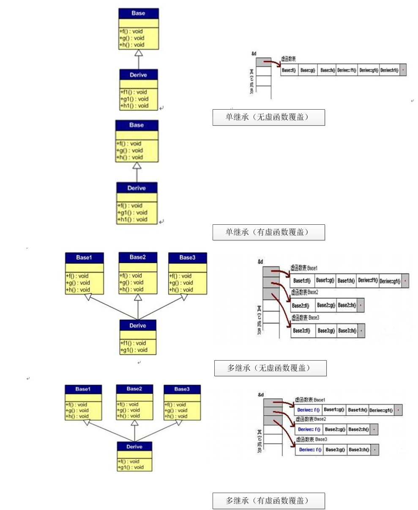

<link rel="stylesheet" href="../lib/font-awesome-4.7.0/css/font-awesome.min.css">
<link rel="stylesheet" href=../lib/my.css>

<a href="#top"><i class="fa fa-angle-up fa-3x button"></i></a>

### <a id='top' href="../README.md">C++面试必考汇总<i class="fa fa-reply" aria-hidden="true"></i></a>

### 1.new、delete、malloc、free关系
1. malloc/free是C/C++语言的标准库函数，new/delete是C++的运算符。它们都可用于申请动态内存和释放内存。但是new能够自动分配空间大小，而malloc需要计算字节数。
2. 对于非内部数据类型的对象而言，光用maloc/free无法满足动态对象的要求。对象在创建的同时要自动执行构造函数，对象在消亡之前要自动执行析构函数。由于malloc/free是库函数而不是运算符，不在编译器控制权限之内，不能够把执行构造函数和析构函数的任务强加于malloc/free。因此C++语言需要一个能完成动态内存分配和初始化工作的运算符new，以及一个能完成清理与释放内存工作的运算符delete。注意new/delete不是库函数。---简而言之 new/delete能进行对对象进行构造和析构函数的调用进而对内存进行更加详细的工作，而malloc/free不能。
3. new是类型安全的，而malloc不是，比如：
    ```
    int* p = new float[2]; // 编译时指出错误
    int* p = malloc(2*sizeof(float)); // 编译时无法指出错误
    ```
    new operator 由两步构成，分别是 operator new 和 construct
4. 返回值。malloc分配失败时，返回的是空指针。1993年前，c++一直要求在内存分配失败时operator  new要返回0，现在则是要求operator  new抛出std::bad_alloc异常。很多c++程序是在编译器开始支持新规范前写的。c++标准委员会不想放弃那些已有的遵循返回0规范的代码，所以他们提供了另外形式的operator  new(以及operator  new[])以继续提供返回0功能。这些形式被称为“无抛出”，因为他们没用过一个throw，而是在使用new的入口点采用了nothrow对象:
    ```
    class   widget   {   ...   };
    widget   *pw1   =   new   widget;//   分配失败抛出std::bad_alloc
    if   (pw1   ==   0)   ... //   这个检查一定失败
    widget   *pw2   =   new   (nothrow)   widget;   //   若分配失败返回0
    if   (pw2   ==   0)   ... //   这个检查可能会成功
    ```
- 联系：
既然new/delete的功能完全覆盖了malloc/free，为什么C++还保留malloc/free呢？

    因为C++程序经常要调用C函数，而C程序只能用malloc/free管理动态内存。如果用free释放“new创建的动态对象”，那么该对象因无法执行析构函数而可能导致程序出错。如果用delete释放“malloc申请的动态内存”，理论上讲程序不会出错，但是该程序的可读性很差。所以new/delete，malloc/free必须配对使用。

---
### 2.delete与 delete []区别
`delete`只会调用一次析构函数，而delete[]会调用每一个成员的析构函数。在`More Effective C++`中有更为详细的解释：“当`delete`操作符用于数组时，它为每个数组元素调用析构函数，然后调用`operator delete`来释放内存。”`delete`与`new`配套，`delete []`与`new []`配套
```C++
MemTest *mTest1=new MemTest[10];
MemTest *mTest2=new MemTest;
Int *pInt1=new int [10];
Int *pInt2=new int;
delete[]pInt1; //-1-
delete[]pInt2; //-2-
delete[]mTest1;//-3-
delete[]mTest2;//-4-
```
在-4-处报错。

这就说明：对于内建简单数据类型，`delete`和`delete[]`功能是相同的。对于自定义的复杂数据类型，`delete`和`delete[]`不能互用。`delete[]`删除一个数组，`delete`删除一个指针。简单来说，用`new`分配的内存用`delete`删除；用`new[]`分配的内存用`delete[]`删除。`delete[]`会调用数组元素的析构函数。内部数据类型没有析构函数，所以问题不大。如果你在用`delete`时没用括号，`delete`就会认为指向的是单个对象，否则，它就会认为指向的是一个数组。

---
### 3. C++有哪些性质（面向对象特点)
 封装，继承和多态。

**封装性**：实现了类的接口和实现的分离，类的接口包括用户所能执行的操作，类的实现则包括类的数据成员、负责接口实现的函数体以及定义类所需的各种私有函数。封装后的类隐藏了它的实现细节，也就是说，类的用户只能使用接口而无法访问实现部分。封装确保了用户代码不会无意间破坏封装对象的状态，并且被封装的类的具体实现细节可以随时改变，而无需调整用户级别的代码。

**继承性**：提供从已存在的类创建新类的机制，继承使一个新类自动拥有父类的全部成员，通过继承联系在一起的类构成一种层次关系。继承可以使得子类具有父类的各种属性和方法，而不需要再次编写相同的代码，在令子类继承父类的同时，可以重新定义某些属性和方法，即覆盖父类的原有属性和方法，使其获得与父类不同的功能。
#### 继承的方式是public，此外还有protected和private，具体如下：
- public公有继承，父类的所有公有、保护成员都按部就班的继承到子类。
- protected保护继承，父类的所有公有、保护成员都继承为子类的保护成员。
- private私有继承，父类的所有公有、保护成员都继承为子类的私有成员。

**多态性**：多态是指相同对象收到不同消息或者不同对象收到相同消息是产生的不同的动作。有静态多态和动态多态两种表现形式。

- **静态多态**（相同对象收到不同消息）：以重载为基础，通过对象进行的函数调用在编译时进行绑定，对象的类型是确定不变的，只需在编译时根据形参列表（形参数量、形参类型）确定具体函数即可。
- **动态多态**（不同对象收到相同消息）：以封装、继承和虚函数为基础，当使用基类的引用或指针调用虚函数时，编译器产生的代码直到运行时才能确定应该调用哪个版本，被调用的函数是与绑定到指针或引用上的对象的动态类型相匹配的那个。
---
### 4.子类析构时要调用父类的析构函数吗？
析构函数调用的次序是先派生类的析构后基类的析构，也就是说在基类的的析构调用的时候,派生类的信息已经全部销毁了。定义一个对象时先调用基类的构造函数、然后调用派生类的构造函数；析构的时候恰好相反：先调用派生类的析构函数、然后调用基类的析构函数。

---
### 5.多态，虚函数，纯虚函数
**多态**：是对于不同对象接收相同消息时产生不同的动作。C++的多态性具体体现在运行和编译两个方面：在程序运行时的多态性通过继承和虚函数来体现；在程序编译时多态性体现在函数和运算符的重载上；

**虚函数**：在基类中冠以关键字 `virtual` 的成员函数。 它提供了一种接口界面。允许在派生类中对基类的虚函数重新定义。

**纯虚函数的作用**：在基类中为其派生类保留一个函数的名字，以便派生类根据需要对它进行定义。作为接口而存在，纯虚函数不具备函数的功能，一般不能直接被调用。从基类继承来的纯虚函数，在派生类中仍是虚函数。如果一个类中至少有一个纯虚函数，那么这个类被称为抽象类（abstract class）。抽象类中不仅包括纯虚函数，也可包括虚函数。抽象类必须用作派生其他类的基类，而不能用于直接创建对象实例。但仍可使用指向抽象类的指针支持运行时多态性。

---
### 6.求下面函数的返回值（微软）
```C++
int func(x) 
{ 
    int countx = 0; 
    while(x) 
    { 
        countx ++; 
        x = x&(x-1); 
    } 
    return countx; 
}
```
假定x = 9999。 答案：8

思路：将x转化为2进制，看含有的1的个数。

---
### 7.什么是“引用”？申明和使用“引用”要注意哪些问题？
引用就是某个目标变量的**“别名”(alias)**，对应用的操作与对变量直接操作效果完全相同。申明一个引用的时候，切记要对其进行初始化。引用声明完毕后，相当于目标变量名有两个名称，即该目标原名称和引用名，不能再把该引用名作为其他变量名的别名。声明一个引用，不是新定义了一个变量，它只表示该引用名是目标变量名的一个别名，它本身不是一种数据类型，因此引用本身不占存储单元，系统也不给引用分配存储单元。不能建立数组的引用。

---
### 8.将“引用”作为函数参数有哪些特点？
（1）传递引用给函数与传递指针的效果是一样的。这时，被调函数的形参就成为原来主调函数中的实参变量或对象的一个别名来使用，所以在被调函数中对形参变量的操作就是对其相应的目标对象（在主调函数中）的操作。

（2）使用引用传递函数的参数，在内存中并没有产生实参的副本，它是直接对实参操作；而使用一般变量传递函数的参数，当发生函数调用时，需要给形参分配存储单元，形参变量是实参变量的副本；如果传递的是对象，还将调用拷贝构造函数。因此，当参数传递的数据较大时，用引用比用一般变量传递参数的效率和所占空间都好。

（3）使用指针作为函数的参数虽然也能达到与使用引用的效果，但是，在被调函数中同样要给形参分配存储单元，且需要重复使用`*指针变量名`的形式进行运算，这很容易产生错误且程序的阅读性较差；另一方面，在主调函数的调用点处，必须用变量的地址作为实参。而引用更容易使用，更清晰。

---
### 9.在什么时候需要使用“常引用”？
如果既要利用引用提高程序的效率，又要保护传递给函数的数据不在函数中被改变，就应使用常引用。常引用声明方式：
`const 类型标识符 &引用名=目标变量名`；

例1
```C++
int a ;
const int &ra=a;
ra=1; //错误
a=1; //正确
```
例2
```C++
string foo();
void bar(string & s);
//那么下面的表达式将是非法的：
bar(foo( ));
bar("hello world");
```
原因在于`foo( )`和`"hello world"`串都会产生一个临时对象，而在C++中，这些临时对象都是const类型的。因此上面的表达式就是试图将一个const类型的对象转换为非const类型，这是非法的。引用型参数应该在能被定义为const的情况下，尽量定义为const 。

---
### 10.将“引用”作为函数返回值类型的格式、好处和需要遵守的规则?
**格式**：`类型标识符 &函数名（形参列表及类型说明）{ //函数体 }`

**好处**：在内存中不产生被返回值的副本；（注意：正是因为这点原因，所以返回一个局部变量的引用是不可取的。因为随着该局部变量生存期的结束，相应的引用也会失效，产生runtime error! 

**注意事项：**

（1）不能返回局部变量的引用。这条可以参照`Effective C++[1]`的Item 31。主要原因是局部变量会在函数返回后被销毁，因此被返回的引用就成为了"无所指"的引用，程序会进入未知状态。

（2）不能返回函数内部new分配的内存的引用。这条可以参照`Effective C++[1]`的Item 31。虽然不存在局部变量的被动销毁问题，可对于这种情况（返回函数内部new分配内存的引用），又面临其它尴尬局面。例如，被函数返回的引用只是作为一个临时变量出现，而没有被赋予一个实际的变量，那么这个引用所指向的空间（由new分配）就无法释放，造成memory leak。

（3）可以返回类成员的引用，但最好是const。这条原则可以参照`Effective C++[1]`的Item 30。主要原因是当对象的属性是与某种业务规则（business rule）相关联的时候，其赋值常常与某些其它属性或者对象的状态有关，因此有必要将赋值操作封装在一个业务规则当中。如果其它对象可以获得该属性的非常量引用（或指针），那么对该属性的单纯赋值就会破坏业务规则的完整性。

（4）流操作符重载返回值申明为“引用”的作用：流操作符`<<`和`>>`，这两个操作符常常希望被连续使用，例如：`cout << "hello" << endl;`　因此这两个操作符的返回值应该是一个仍然支持这两个操作符的流引用。可选的其它方案包括：返回一个流对象和返回一个流对象指针。但是对于返回一个流对象，程序必须重新（拷贝）构造一个新的流对象，也就是说，连续的两个`<<`操作符实际上是针对不同对象的！这无法让人接受。对于返回一个流指针则不能连续使用`<<`操作符。因此，返回一个流对象引用是惟一选择。这个唯一选择很关键，它说明了引用的重要性以及无可替代性，也许这就是C++语言中引入引用这个概念的原因吧。赋值操作符`=`。这个操作符象流操作符一样，是可以连续使用的，例如：`x = j = 10;`或者`(x=10)=100;`赋值操作符的返回值必须是一个左值，以便可以被继续赋值。因此引用成了这个操作符的惟一返回值选择。
```C++
＃include<iostream.h>
int &put(int n);
int vals[10];
int error=-1;
void main()
{
    put(0)=10; //以put(0)函数值作为左值，等价于vals[0]=10; 
    put(9)=20; //以put(9)函数值作为左值，等价于vals[9]=20; 
    cout<<vals[0]; 
    cout<<vals[9];
} 
int &put(int n)
{
    if (n>=0 && n<=9 ) return vals[n]; 
    else { cout<<"subscript error"; return error; }
}
```
（5）在另外的一些操作符中，却千万不能返回引用：`+-*/ `四则运算符。它们不能返回引用，`Effective C++[1]`的Item23详细的讨论了这个问题。主要原因是这四个操作符没有**side effect**，因此，它们必须构造一个对象作为返回值，可选的方案包括：返回一个对象、返回一个局部变量的引用，返回一个new分配的对象的引用、返回一个静态对象引用。根据前面提到的引用作为返回值的三个规则，第2、3两个方案都被否决了。静态对象的引用又因为`((a+b) == (c+d))`会永远为true而导致错误。所以可选的只剩下返回一个对象了。

---
### 11.结构与联合有和区别？
(1). 结构和联合都是由多个不同的数据类型成员组成, 但在任何同一时刻, 联合中只存放了一个被选中的成员（所有成员共用一块地址空间）, 而结构的所有成员都存在（不同成员的存放地址不同）。 

(2). 对于联合的不同成员赋值, 将会对其它成员重写, 原来成员的值就不存在了, 而对于结构的不同成员赋值是互不影响的。

---
### 12.试写出程序结果：
```C++
int  a=4;
int  &f(int  x)
{
    a=a+x;
    return  a;
}

int main(void)
{
    int t=5;
    cout<<f(t)<<endl;//a = 9
    f(t)=20;//a = 20
    cout<<f(t)<<endl;//t = 5,a = 20  a = 25
    t=f(t);//a = 30 t = 30
    cout<<f(t)<<endl;//t = 30 a=60
}
```
---
### 13.重载（overload)和重写(overried，有的书也叫做“覆盖”）的区别？
重载：是指允许存在多个同名函数，而这些函数的参数表不同（或许参数个数不同，或许参数类型不同，或许两者都不同）

重写：是指子类重新定义父类虚函数的方法。

重载：编译器根据函数不同的参数列表，对同名函数的名称做修饰，然后这些同名函数就成了不同的函数（至少对于编译器来说是这样的）。如，有两个同名函数：`function func(p:integer):integer;`和`function func(p:string):integer;`。那么编译器做过修饰后的函数名称可能是这样的：`int_func、str_func`。对于这两个函数的调用，在编译期间就已经确定了，是静态的。也就是说，它们的地址在编译期就绑定了（早绑定），因此，重载和多态无关！

重写：和多态真正相关。当子类重新定义了父类的虚函数后，父类指针根据赋给它的不同的子类指针，动态的调用属于子类的该函数，这样的函数调用在编译期间是无法确定的（调用的子类的虚函数的地址无法给出）。因此，这样的函数地址是在运行期绑定的（晚绑定）。

---
### 14.有哪几种情况只能用`intialization list`而不能用`assignment`?
当类中含有`const`、`reference` 成员变量；基类的构造函数都需要初始化表。

---
### 15. C++是不是类型安全的？
不是。两个不同类型的指针之间可以强制转换（用`reinterpret cast`)。C#是类型安全的。

---
### 16. main 函数执行以前，还会执行什么代码？
全局对象的构造函数会在main 函数之前执行。

**main函数执行之前，主要就是初始化系统相关资源：**
  - 设置栈指针
  - 初始化static静态和global全局变量，即data段的内容
  - 将未初始化部分的赋初值：数值型short，int，long等为0，bool为FALSE，指针为NULL，等等，即.bss段的内容
  - 运行全局构造器，估计是C++中构造函数之类的吧
  - 将main函数的参数，argc，argv等传递给main函数，然后才真正运行main函数

---
### 17. 描述内存分配方式以及它们的区别?
1） 从静态存储区域分配。内存在程序编译的时候就已经分配好，这块内存在程序的整个运行期间都存在。例如全局变量，`static`变量。

2） 在栈上创建。在执行函数时，函数内局部变量的存储单元都可以在栈上创建，函数执行结束时这些存储单元自动被释放。栈内存分配运算内置于处理器的指令集。

3） 从堆上分配，亦称动态内存分配。程序在运行的时候用`malloc`或`new`申请任意多少的内存，程序员自己负责在何时用`free`或`delete`释放内存。动态内存的生存期由程序员决定，使用非常灵活，但问题也最多。

---
### 18.分别写出`BOOL`,`int`,`float`,`指针`类型的变量`a`与“零”的比较语句。
```C++
//BOOL : 
if ( !a ) or if(a)
//int : 
if ( a == 0)
//float : 
const EXPRESSION EXP = 0.000001
if ( a < EXP && a >-EXP)
//pointer :
if ( a != NULL) or if(a == NULL)
```

---
### 19.请说出`const`与`#define `相比，有何优点？
const作用：定义常量、修饰函数参数、修饰函数返回值三个作用。被`Const`修饰的东西都受到强制保护，可以预防意外的变动，能提高程序的健壮性。

1）`const`常量有数据类型，而宏常量没有数据类型。编译器可以对前者进行类型安全检查。而对后者只进行字符替换，没有类型安全检查，并且在字符替换可能会产生意料不到的错误。

>内存空间的分配上。define进行宏定义的时候，不会分配内存空间，编译时会在main函数里进行替换，只是单纯的替换，不会进行任何检查,比如类型，语句结构等，即宏定义常量只是纯粹的置放关系，如#define null 0；编译器在遇到null时总是用0代替null它没有数据类型.而const定义的常量具有数据类型，定义数据类型的常量便于编译器进行数据检查，使程序可能出现错误进行排查,所以const与define之间的区别在于const定义常量排除了程序之间的不安全性.

2） 有些集成化的调试工具可以对`const`常量进行调试，但是不能对宏常量进行调试。

3）在C++程序中只使用const常量而不使用宏常量，即const常量完全取代宏常量。

---
### 20.简述数组与指针的区别？
数组要么在静态存储区被创建（如全局数组），要么在栈上被创建。指针可以随时指向任意类型的内存块。

(1)修改内容上的差别
```C++
char a[] = “hello”;
a[0] = ‘X’;
char *p = “world”; // 注意p 指向常量字符串
p[0] = ‘X’; // 编译器不能发现该错误，运行时错误
```
(2) 用运算符sizeof 可以计算出数组的容量（字节数）。sizeof(p),p 为指针得到的是一个指针变量的字节数，而不是p 所指的内存容量。C++/C 语言没有办法知道指针所指的内存容量，除非在申请内存时记住它。注意当数组作为函数的参数进行传递时，该数组自动退化为同类型的指针。
```C++
char a[] = "hello world";
char *p = a;
cout<< sizeof(a) << endl; // 12 字节
cout<< sizeof(p) << endl; // 4 字节
```
计算数组和指针的内存容量
```C++
void Func(char a[100])
{
    cout<< sizeof(a) << endl; // 4 字节而不是100 字节
}
```
---
### 21. int (*s[10])(int) 表示的是什么？
int (*s[10])(int) 函数指针数组，每个指针指向一个int func(int param)的函数。

---
### 22.栈内存与文字常量区
```C++
char str1[] = "abc";
char str2[] = "abc";
const char str3[] = "abc";
const char str4[] = "abc";

const char *str5 = "abc";
const char *str6 = "abc";

char *str7 = "abc";
char *str8 = "abc";

cout << ( str1 == str2 ) << endl;//0  分别指向各自的栈内存
cout << ( str3 == str4 ) << endl;//0  分别指向各自的栈内存
cout << ( str5 == str6 ) << endl;//1指向文字常量区地址相同
cout << ( str7 == str8 ) << endl;//1指向文字常量区地址相同
```
结果是：0 0 1 1

解答：str1,str2,str3,str4是数组变量，它们有各自的内存空间；而str5,str6,str7,str8是指针，它们指向相同的常量区域。

---
### 23.将程序跳转到指定内存地址
要对绝对地址`0x100000`赋值，我们可以用`(unsigned int*)0x100000 = 1234;`那么要是想让程序跳转到绝对地址是`0x100000`去执行，应该怎么做？
```C++
*((void (*)( ))0x100000 ) ( );
//首先要将0x100000强制转换成函数指针,即:
(void (*)())0x100000
//然后再调用它:
*((void (*)())0x100000)();
//用typedef可以看得更直观些:
typedef void(*)() voidFuncPtr;
*((voidFuncPtr)0x100000)();
```
---
### 24.`int id[sizeof(unsigned long)];`这个对吗？为什么？
正确，这个`sizeof`是编译时运算符，编译时就确定了  ,可以看成和机器有关的常量。

---
### 25.引用与指针有什么区别？
1) 引用必须被初始化，指针不必。

2) 引用初始化以后不能被改变，指针可以改变所指的对象。

3) 不存在指向空值的引用，但是存在指向空值的指针。

4) 引用不是实际的对象，因此不会给应用分配内存，也不存在引用型数组。

  - 引用并非对象，它是已存在对象的别名，引用不能为空，当引用被创建的时候必须被初始化；指针本身是一个对象，存放的是他所指对象的地址，指针则可以在任何时候被初始化，可以初始化为空。
  - 指针和引用都能提供对其他对象的间接访问，引用一旦定义就无法令其再绑定另外的对象，指针可以在任何时候指向另一个对象。
  - “sizeof(引用)”得到的是所指变量(对象)的大小，而“sizeof(指针)”得到的是指针本身的大小。
  - 给引用赋值修改的是该引用所关联的对象的值，而并不是是引用与另一个对象关联。
  - 引用使用时不需要解引用，而指针需要解引用，引用和指针的自增(++)操作运算意义不同。
  - 如果返回动态分配的对象或内存，必须使用指针，引用可能引起内存泄漏。
  - 当使用&运算符取一个引用的地址是，其值为所引用变量的地址；而对指针使用&运算，取的是指针变量的地址。
  - ?引用只有对常量的引用?；指针则包括指向常量的指针和常量指针。常量指针必须被初始化，他的值不能不能改变。
  - 用指针传递参数，可以实现对实参进行改变的目的，是因为传递过来的是实参的地址，因此使用*a实际上是取存储实参的内存单元里的数据，即是对实参进行改变，因此可以达到目的。在将引用作为函数参数进行传递时，实质上传递的是实参本身，即传递进来的不是实参的一个拷贝，因此对形参的修改其实是对实参的修改，所以在用引用进行参数传递时，不仅节约时间，而且可以节约空间。
  - 引用比指针更安全。由于不存在空引用，并且引用一旦被初始化为指向一个对象，它就不能被改变为另一个对象的引用，因此引用很安全。对于指针来说，它可以随时指向别的对象，并且可以不被初始化，或为NULL，所以不安全。const 指针虽然不能改变指向，但仍然存在空指针，并且有可能产生野指针（即多个指针指向一块内存，free掉一个指针之后，别的指针就成了野指针）
---
### 26.复杂声明
```C++
void * ( * (*fp1)(int))[10];
float (*(* fp2)(int,int,int))(int);
int (* ( * fp3)())[10]();
```
分别表示什么意思？

1）`void * ( * (*fp1)(int))[10]; `  fp1是一个指针，指向一个函数，这个函数的参数为`int`型，函数的返回值是一个指针，这个指针指向一个数组，这个数组有10个元素，每个元素是一个`void*`型指针。

2）`float (*(* fp2)(int,int,int))(int);`   fp2是一个指针，指向一个函数，这个函数的参数为3个`int`型，函数的返回值是一个指针，这个指针指向一个函数，这个函数的参数为int型，函数的返回值是`float`型。

3）`int (* ( * fp3)())[10]();`   fp3是一个指针，指向一个函数，这个函数的参数为空，函数的返回值是一个指针，这个指针指向一个数组，这个数组有10个元素，每个元素是一个指针，指向一个函数，这个函数的参数为空，函数的返回值是`int`型。

---
### 27.基类的析构函数不是虚函数，会带来什么问题？
如果基类指针指向派生类对象，则通过该指针调用的函数如果是虚函数时会根据指针具体指向的类型在运行时动态绑定。如果析构函数不是虚函数，当碰到前述情形时，只能调用基类的析构函数，而不能调用派生类的析构函数，因此派生类中的对象不能被正确释放，因此会造成资源泄露。

---
### 28.全局变量和局部变量有什么区别？是怎么实现的？操作系统和编译器是怎么知道的？
生命周期不同：全局变量随主程序创建而创建，随主程序销毁而销毁；局部变量在局部函数内部，甚至局部循环体等内部存在，退出就不存在；

使用方式不同：通过声明后全局变量程序的各个部分都可以用到；局部变量只能在局部使用；分配在栈区。 

操作系统和编译器通过内存分配的位置来知道的，全局变量分配在全局数据段并且在程序开始运行的时候被加载。局部变量则分配在堆栈里面 。

---
星期一, 07. 八月 2017 08:26上午 

### 29.C与C++的区别
这个区别有好多，首先C是面向过程的，C++是面向对象的，所以C里没有类的概念，C++具有封装、继承、多态这样的面向对象特性；然后C++使用了STL模板库；C++在很多概念上对C做了扩展，比如`static`关键字，在C++中可以用在成员函数前面表示静态成员函数；c++具有流式输入输出，`inline`关键字，引用变量等新特性。

---
### 30.多态性都有哪些
一是编译时的多态性，二是运行时的多态性。

编译时的多态性：编译时的多态性是通过重载来实现的。对于非虚的成员来说，系统在编译时，根据传递的参数、返回的类型等信息决定实现何种操作。

运行时的多态性(虚函数)：运行时的多态性就是指直到系统运行时，才根据实际情况决定实现何种操作。即父类引用指向子类对象。

---
### 31.动态绑定（联编）怎么实现
绑定是为了确定函数调用与执行的代码段之间的关系。静态绑定在编译阶段完成，如类私有成员，静态成员。动态绑定在运行时完成，动态绑定方便了多态的实现。在C++中，动态绑定通过虚函数表实现，虚函数表里的每一个位置都是一个函数指针，含有虚函数的类有一个虚函数表指针。

---
### 32.类型转换有哪些
隐式转换和显示转换，隐式转换是C时代的遗留产物。显示转换分为四种：

`static_cast`:适用范围和隐式转换相同，没有类型检查。
`dynamic_cast`:主要用于类层次间的上行和下行转换，待转换的类型只能是指针或引用，具有运行时类型检查。
`reinterpret_cast`:强制类型转换。
`const_cast`:用于增加或删除`const`特性，我记得effective c++里说这个主要为了方便非const函数操作const成员产量。

- C风格的类型转换--强制类型转换（type)expression
- C++中类型转换有：static_cast, const_cast, dynamic_cast, reinterpret_cast
1. static_cast: 任何具有明确定义的类型转换，只要不包含底层const，都可以使用static_cast。
    ```
    double s = static_cast<double>(j)/i;
    ```
    当需要把一个较大的算术类型赋值给较小的类型时，static_cast告诉编译器：不在乎潜在的精度损失。通常，如果编译器发现一个较大的算术类型试图赋值给较小的类型时，会发出警告，但是当执行了显示地类型转换之后，警告信息会被关闭。
    static_cast对于编译器无法自动执行的类型转换非常有用
    ```
    void* p = &d; double* dp = static_cast<double*>(p);
    ```
2. const_cast: 改变运算对象的底层const属性，可添加可去除，常用于函数重载。
    eg：比较两个string的长度，返回较短的那个引用
    ```
    const string &shortString(const string &s1, const string &s2){
        return s1.size()<=s2.size() ? s1: s2 ;
    }
    ```
    这个函数的参数和返回类型都是const string的引用，如果对两个非常量的string实参调用这个函数，返回结果仍然是const string的引用，所以需要重新定义该函数的非常量版本。
    ```
    string &shortString(string &s1, string &s2){
        auto &r = shortString(const_cast<const string&> (s1), const_cast<const string&>(s2));
        return const_cast<string&>(r);
    }
    ```
    这个函数首先将实参强制转换成const的引用，然后调用函数的const版本，最后返回强制转换为常量的结果。

3. reinterpret_cast：用来处理无关类型之间的转换，他会产生一个新值，这个值与原始参数具有相同的比特位。它可以把一个指针转换成一个整数，也可以把一个整数转换成一个指针（先把一个指针转换成一个整数，再把该整数转换成原类型的指针，还可以得到原先的指针值）。

4. dynamic_cast：派生类的指针或引用与基类的指针或引用之间的互相的强制转换。

    特别适用于：我们想使用基类的指针或引用，执行某个派生类操作，并且这个操作不是虚函数。不用于内置的基本数据类型的强制转换。使用dynamic_cast进行转换，基类中一定要有虚函数，否则编译不通过。dynamic_cast转换如果成功的话返回的是指向类的指针或引用，转换失败的话前者返回0，后者抛出bad_cast异常。其他三种都是编译时完成的，dynamic_cast是运行时处理的，运行时要进行类型检查。eg：基类Base（至少有一个虚函数），派生类Derived
    ```
    Base *bp;
    Derived *dp=dynamic_cast<Base*>(bp)。
    ```
---
### 33.指针和const的用法？
```C++
int *p;//p是一个指向int类型的指针，p的值可以改变，p指向的值也可以改变
const int *p;//p是一个指向const int类型的指针，p的值可以改变，不能通过p修改其指向的值
int * const p;//p是一个指向int类型的从上图指针，p的值不可以改变，可以通过p修改其指向的值
const int * const p;//p是一个指向const int类型的const指针，p的值不可以改变，也不能通过p修改其指向的值
```
总的来说，这里把*看成向左结合的运算符，然后`const`右边紧跟什么，什么就是不可变的。

---
### 34.虚函数、纯虚函数如何定义，为什么析构函数要定义成虚函数？
在C++中，虚函数在函数前加`virtual`，纯虚函数就是普通的虚函数后面加上=0；Java中所有的函数默认都是虚函数，非虚函数需要在前面加上`final`，纯虚函数在前面加上`abstract`。

含有纯虚函数的类称为抽象类，全为纯虚函数的类称为接口，Java接口需用`interface`修饰。

析构函数定义成虚函数是为了避免只析构基类没有析构派生类造成内存泄露。

扩展：
>C++虚函数==Java普通函数

>C++纯虚函数==Java抽象函数

>C++抽象类==Java抽象类

>C++虚基类==Java接口

---
### 35.内联函数
类中定义的成员函数全部默认为内联函数，普通函数声明或定义前加inline也是内联函数。内联函数在编译后即不具有函数性质，被调用几次就会生成几段代码，用来节省函数调用的时间开销，但是会增加编译后的可执行文件大小。内联函数作用和宏类似，但是相对于宏具有很多优点。首先说一下宏的缺点：

1)宏不能访问对象的私有成员。

2)宏的定义很容易产生二义性。

使用内联函数的优点：

1)内联函数在运行时可调试，而宏定义不可以;

2)编译器会对内联函数的参数类型做安全检查或自动类型转换（同普通函数），而宏定义则不会；

3)内联函数可以访问类的成员变量，宏定义则不能；

4)不会存在宏那样的二义性问题。

---
### 36.链接指示：extern“C”（作用）
extern "C"的主要作用就是为了能够正确实现C++代码调用其他C语言代码。加上extern "C"后，会指示编译器这部分代码按C语言的进行编译，而不是C++的。由于C++支持函数重载，因此编译器编译函数的过程中会将函数的参数类型也加到编译后的代码中，而不仅仅是函数名；而C语言并不支持函数重载，因此编译C语言代码的函数时不会带上函数的参数类型，一般只包括函数名。

---
### 37.预编译、编译、运行
如前所述，Java没有预编译，C/C++的预编译指的是#的部分，即头文件和define宏，编译以后生成目标程序（C/C++生成.o,.a,Java生成.class），即一种字节流，运行以后生成可执行文件(windows下为exe）。
***
### 38. 类的封装：private，protected，public
- private：类内成员、友元可访问；类的用户不可访问
- protected：类内成员、友元可访问；类的用户不可访问
- public：类内成员、友元、类的用户都可访问

  **涉及到继承**
- public继承：基类的公有成员、受保护成员按部就班继承到子类
- protected继承：基类的公有成员、受保护成员都继承为子类的protected成员
- private继承：基类的公有成员、受保护成员都继承为子类的private成员
---
### 39. 继承机制中对象之间是如何转换的？
- 存在继承关系的类型之间的转换规则： 
1. 从派生类向基类的类型转换只对指针或引用类型有效。
2. 基类向派生类不存在隐式类型转换。
3. 和任何其他成员一样，派生类向基类的类型转换也可能会由于访问受限而变得不可行。

   **基类与派生类之间的显式类型转换参考dynamic_cast。**
- 对于派生类向基类的类型转换的可访问性，有以下三种情况：（假设D继承自B） 
1. 用户：只有当D公有的继承自B时，用户代码才可以使用派生类向基类的转换，否则，不可以使用。

2. 成员，友元：不论D以何种方式继承自B，D的成员函数及友元都可以使用派生类向基类的转换。 

3. 派生类：如果D继承自B的方式是公有的或受保护的，则D的派生类的成员和友元可以使用D向B的类型转换，否则，不能使用

---
### 40. 继承机制中引用和指针之间如何转换？
- 派生类——>基类：可以用dynamic_cast或者直接进行类型转换（直接赋值）。

- 基类——>派生类：用dynamic_cast转换，首先检查基类指针（引用）是否真正指向一个派生类对象，然后再做相应处理，对指针进行dynamic_cast，成功返回派生类对象，失败返回空指针，对引用进行dynamic_cast，成功返回派生类对象，失败抛出一个异常。 

---
### 41. 虚函数，虚函数表里面内存如何分配？

虚函数是通过虚函数表实现的，C++的编译器保证虚函数表的指针存在于对象实例中最前面的位置，虚函数表中每项存储一个函数指针。

**分为以下几种情况：** 
- 对于无虚函数覆盖的继承：虚函数按照其声明顺序放在虚函数表中；父类的虚函数在其子类的虚函数的前面。 
- 对于有虚函数覆盖的继承：派生类中起覆盖作用的虚函数放在原基类虚函数的位置；没有被覆盖的虚函数依旧。 
- 对于无虚函数覆盖的多重继承：每个父类都有自己的虚函数表；派生类的虚函数被放在了第一个父类的虚函数表中（按照声明顺序排序）。 
- 对于有虚函数覆盖的多重继承：派生类中起覆盖作用的虚函数放在原基类虚函数的位置；没有被覆盖的虚函数依旧。


---
### 41. 虚函数的作用，优点
- 虚函数的作用：是减少对基类的重复，代价是增加了虚函数表指针的负担。
- 虚函数的优点：是动态绑定的基础，使得派生类各自定义适应自己的版本。

---
### 42. 虚函数、纯虚函数、析构函数、构造函数
- **虚函数：（只执行动态类型的版本）**：
在C++语言中，基类将类型相关的函数和派生类不作改变直接继承的函数区别对待。对于某些函数，基类希望它的派生类各自定义适合自身的版本，此时基类就将这些函数声明成虚函数。方法是在类内的成员函数前加virtual声明。
- **纯虚函数**：
在类的内部声明虚函数时，在分号之前使用了=0，即为纯虚函数。一个纯虚函数不需要被定义。含有纯虚函数的类是抽象基类。如果派生类没有对继承而来的纯虚函数定义自己的版本，则该派生类也是抽象的。抽象类无法实例化对象，他负责定义接口。
- **虚析构函数（执行动态类型的版本+基类版本）**：
析构函数的作用是在对象撤销之前把类的对象从内存中撤销。
如果析构函数不是虚函数，那么delete一个指向派生类的基类指针时，派生类部分无法析构，从而造成内存泄漏。
- **构造函数**：
不能是虚函数，因为如果基类指针指向派生类，那么执行构造函数时，如果声明为虚函数，则只会执行派生类的构造函数，基类部分就不能构造了。

---
### 43. 如何实现只能动态分配类对象，只能静态分配？
- **动态分配类对象**：使用new运算符将对象建立在堆空间中。这个过程分为两步，第一步是执行operator new()函数，在堆空间中搜索合适的内存并进行分配；第二步是调用构造函数构造对象，初始化这片内存空间。这种方法，间接调用类的构造函数。
- **静态分配类对象**：即A a，由编译器为对象在栈空间中分配内存，是通过直接移动栈顶指针，挪出适当的空间，然后在这片内存空间上调用构造函数形成一个栈对象。

1. **只能动态分配（在堆上分配内存）**

    将类的构造函数和析构函数设为protected属性，类的对象不能访问，但类的派生类可以访问，能够正常的继承。同时创建另外两个create和destory函数类创建对象（将create设为static原因是：创建对象的时候是A *p = A::create(); 只有静态成员函数才能够通过类名来访问。）
   ```
   class A  
   {  
   protected:  
       A(){}  
       ~A(){}  
   public:  
       static A* create()  
       {  
           return new A();  
       }  
       void destory()  
       {  
           delete this;  
       }  
   }; 
   ```
2. **只能静态分配（在栈上分配内存）**

    把new和delete运算符重载为private属性即可
    ```
    class A  
    {  
    private:  
        void* operator new(size_t t){}     // 注意函数的第一个参数和返回值都是固定的  
        void operator delete(void* ptr){} // 重载了new就需要重载delete  
    public:  
        A(){}  
        ~A(){}  
    }; 
    ```
---
### 44. 静态成员函数和静态数据成员有什么意义？

- 静态数据成员：

1. 定义：在类中声明静态数据成员很简单，是以static关键字表明即可。一般在全局作用域对静态数据成员初始化，如果不赋予初值，则使用其默认值零  
2. 不与任何对象绑定在一起，被类的所有对象共享，包括该类的派生类对象，基类对象和派生类对象共享基类的静态数据成员
3. 在const函数中可以修改，而普通的数据成员是万万不能修改的（const修饰的是当前this指针所指向的对象是const，但是静态数据成员不属于任何类的对象，它被类的所有对象修改，所以this指针不修饰静态的数据成员，所以可以更改）。
4. 类型可以是所属类的类型，普通数据成员只能声明为所属类类型的指针或引用
5. 可以作为成员函数的默认形参，而普通数据成员则不可以

- 静态成员函数：

1. 声明：在成员函数前加static
2. 静态成员函数不与任何对象绑定在一起，不包含this指针，所以不能声明成const，也不能调用非静态成员函数
---
### 45. 必须在构造函数初始化式里进行初始化的数据成员有哪些？
- 构造函数中，成员变量一定要通过初始化列表来初始化的有以下几种情况：
1. const常量成员，因为常量只能在初始化，不能赋值，所以必须放在初始化列表中；
2. 引用类型，引用必须在定义的时候初始化，并且不能重新赋值，所以也要写在初始化列表中；
3. 没有默认构造函数的类类型，因为使用初始化列表可以不必调用默认构造函数来初始化，而是直接调用拷贝构造函数；
---
###　46. C/C++编程中，经常需要操作的内存
- **栈区（stack）**：由编译器自动分配释放，速度较快，是一块连续的内存区域。用于存放程序临时创建的局部变量，如函数的参数值、局部变量值等。 
- **堆区（heap）**：由程序员申请和释放，速度较慢，是不连续的内存空间，使用更灵活。用于存放动态分配的对象，大小不固定，可动态扩张或缩减。若程序员不释放，程序结束时，可能由操作系统回收，但最好还是由程序员释放。注意：它与数据结构中的堆是两回事，分配方式类似数据结构中的链表。 
- **全局区（静态区static）**：全局变量和静态变量的存储是放在一起的。初始化的全局变量和静态变量在一块区域，未初始化的全局和未初始化的静态在邻近的另一块区域。程序结束后由系统释放。 
- **文字常量区**：存放字符串常量，程序结束后由系统释放。 
- **程序代码区**：存放函数体内的二进制代码。
---
### 47. 堆和栈的区别(heap和stack)
1. heap是堆，stack是栈。堆一般由程序员手动分配释放，栈是由编译器自动分配释放。 
2. stack的空间有限，在window下，栈是向低地址扩展的数据结构，是一块连续的内存区域，大小一般为2M；堆是向高地址扩展的数据结构，是不连续的内存区域，因为由系统用链表来存储空闲内存空间，堆的大小取决于系统的有效虚拟内存，有很大的自由存储区。 
3. stack由系统自动分配，速度较快。Heap由new分配，一般速度比较慢，而且容易产生内存碎片。
---
### 48. 内存泄漏和内存溢出
- **内存溢出 out of memory**：是指程序在申请内存时，没有足够的内存空间供其使用，出现out of memory；比如申请了一个integer,但给它存了long才能存下的数，那就是内存溢出。
- **内存泄露 memory leak**：是指程序在申请内存后，无法释放已申请的内存空间，一次内存泄露危害可以忽略，但内存泄露堆积后果很严重，无论多少内存,迟早会被占光。内存泄露的主要原因就是：malloc之后没有free或者new之后没有delete，memory leak会最终会导致out of memory！
---
### 49. 内存溢出有那些因素及危害
- 使用非类型安全(non-type-safe)的语言如 C/C++ 等，它们既不检查数组边界，又不检查类型可靠性(type-safety)。
- 以不可靠的方式存取或者复制内存缓冲区。当应用程序读取用户(也可能是恶意攻击者)数据，试图复制到应用程序开辟的内存缓冲区中，却无法保证缓冲区的空间足够时，内存缓冲区就可能会溢出。
- 编译器设置的内存缓冲区太靠近关键数据结构。假设某个函数的堆栈紧接在在内存缓冲区后面时，其中保存的函数返回地址就会与内存缓冲区相邻。此时，恶意攻击者就可以向内存缓冲区复制大量数据，从而使得内存缓冲区溢出并覆盖原先保存于堆栈中的函数返回地址。这样，函数的返回地址就被攻击者换成了他指定的数值；一旦函数调用完毕，就会继续执行“函数返回地址”处的代码。非但如此，C++ 的某些其它数据结构，比如 v-table 、例外事件处理程序、函数指针等，也可能受到类似的攻击。
---
### 50. 怎么判断是内存泄漏
   - 看程序开始之后使用的内存和程序结束之后释放的内存是否相等！
---
### 51. 操作符重载
- 重定义了某种内置运算符的含义，由关键字operator和其后要重载的运算符符号构成。重载运算符必须至少含有一个类类型的运算对象。

- **运算符重载时要遵循以下规则：**
1. 除了类属关系运算符"."、成员指针运算符".*"、作用域运算符"::"、sizeof运算符和三目运算符"?:"以外，C++中的所有运算符都可以重载。
2. C++只能重载已有的运算符，无权发明新的运算符。
3. 运算符重载实质上是函数重载，因此编译程序对运算符重载的选择，遵循函数重载的选择原则。比方说，对于“+”来说，根据形参类型判断到底是int还是float的运算，根据形参数量判断是一元运算符还是二元运算符。
4. 重载运算符的优先级、结合律、运算对象数量都与其内置版本一致。
5. 当运算符作用于内置类型的运算对象时，无法改变该运算符的含义。
6. 当重载运算符和内置运算符之间存在逻辑映射关系时（即重载的功能应当与原有功能相类似），运算符重载的效果最好，避免没有目的地使用重载运算符。

- **运算符函数重载一般有两种形式**：重载为类的成员函数和重载为类的非成员函数。非成员函数通常是友元函数。
1. 当运算符重载为类的成员函数时，函数的参数个数比原来的操作数要少一个（后置单目运算符除外），这是因为成员函数用this指针隐式地访问了类的一个对象，它充当了运算符函数最左边的操作数。
2. 当运算符重载为类的友元函数时，由于没有隐含的this指针，因此操作数的个数没有变化，所有的操作数都必须通过函数的形参进行传递，函数的参数与操作数自左至右一一对应。
- 在多数情况下，将运算符重载为类的成员函数和类的友元函数都是可以的。但成员函数运算符与友元函数运算符也具有各自的一些特点：

1. 一般情况下，单目运算符最好重载为类的成员函数；双目运算符则最好重载为类的友元函数。
2. 以下一些双目运算符不能重载为类的友元函数：赋值运算符=、函数调用运算符()、下标运算符[]、箭头运算符->。
3. 类型转换函数只能定义为一个类的成员函数而不能定义为类的友元函数。 C++提供4个类型转换函数：reinterpret_cast（在编译期间实现转换）、const_cast（在编译期间实现转换）、stactic_cast（在编译期间实现转换）、dynamic_cast（在运行期间实现转换，并可以返回转换成功与否的标志）。
4. 若一个运算符的操作需要修改对象的状态，选择重载为成员函数较好。
5. 若运算符所需的操作数（尤其是第一个操作数）希望有隐式类型转换，则只能选用友元函数。
6. 当运算符函数是一个成员函数时，最左边的操作数（或者只有最左边的操作数）必须是运算符类的一个类对象（或者是对该类对象的引用）。如果左边的操作数必须是一个不同类的对象，或者是一个内部类型的对象，该运算符函数必须作为一个友元函数来实现。
7. 当需要重载运算符具有可交换性时，选择重载为友元函数。
---
### 52. 内存对齐的原则？（原则叙述了一下并举例说明）
- 显示规定采用几个字节对齐：
  #pragma pack(n)  编译器将按照n个字节对齐。
- 不显示规定几个字节对齐时：
1. 数据成员对齐规则：结构（struct或联合union）的数据成员，第一个数据成员放在offset为0的地方，以后每个数据成员存储的起始位置要从该成员大小的整数倍开始（比如int在32位机为４字节，则要从4的整数倍地址开始存储）。
2. 结构体作为成员：如果一个结构里有某些结构体成员，则结构体成员要从其内部最大元素大小的整数倍地址开始存储。（struct a里存有struct b，b里有char，int，double等元素，那b应该从8的整数倍开始存储。）
3. 收尾工作：结构体的总大小，也就是sizeof的结果，必须是其内部最大成员的整数倍，不足的要补齐。
```C++
typedef struct bb
{
    int id;             //[0]....[3]
    double weight;      //[8].....[15]　　　　　　原则１
    float height;      //[16]..[19],总长要为８的整数倍,补齐[20]...[23]　　　　　原则３
}BB;

typedef struct aa
{
    char name[2];     //[0],[1]
    int  id;         //[4]...[7]　　　　　　　　　　原则１
    double score;     //[8]....[15]　　　　
    short grade;    //[16],[17]　　　　　　　　
    BB b;             //[24]......[47]　　　　　　　　　　原则２
}AA;
    
struct s1
{
    char a;
    double b;
    int c;
    char d; 
};
//sizeof(struct s1)=1+7+8+4+1+3=24;对界值取8（7,3是为满足对界填充的空间）
struct s2
{
    char a;
    char b;
    int c;
    double d;  
};
//sizeof(struct s2)=1+1+2+4+8=16；对界值取8（2是为满足对界填充的空间）
struct X 
{ 
    short s; 
    int i; 
    char c;
};
//sizeof(struct X)=2+2+4+1+3=12；对界值取4（第二个2和3是为满足对界填充的空间）

int main()
{
    AA a;
    cout<<sizeof(a)<<" "<<sizeof(BB)<<endl;
    return 0;
}
//结果是：48 24
```
---
### 53. 模板怎么实现？
- 一个模板就是一个编译器用来生成特定类类型或函数的蓝图，生成特定类或函数的过程称为实例化。模板包括函数模板和类模板。标准库算法都是函数模板，标准库容器都是类模板。
- **缺点**：模板是一种编译期间生成代码的行为，无法进行断点调试，所以很容易产生bug；大量使用模板会造成代码空间膨胀，极大的延长了编译时间。
---
### 54. 模板特化的概念，为什么特化？
- **概念**：模板特化是指针对某个特定的类型，在定义的时候给出不同一般数据类型的逻辑实现。而在使用的时候，这个特殊性完全被屏蔽，你仍然只需要按照模板来使用，但是编译器会根据你之前的设定，给特别的数据类型以特定的代码逻辑。
- **原因**：在模板的特化上，就表现出来C++的灵活性。我们知道模板是为了让程序员能够脱离具体的数据类型开发出代码模板，在使用的时候有程序员提供具体的数据类型，然后由编译器进行实例化，这就要求所有的使用这个代码模板的数据类型所要跑的数据逻辑是一样的。但是，10个数据类型，可能有一个数据类型，它对某个应用的逻辑过程要求就比较特别，进而不能使用通用的代码模板来进行限定，这个时候，你或许会说，“解决方法很简单，对于该特定的数据类型，我们不使用模板就是了，我们单独为它建立一个逻辑代码过程就可以了”。这是一个解决方法，但是之前你定义的模板是默认“可适应”该数据类型的，而软件开发过程中，你永远不要保证，在后来的程序员中（甚至是你自己）不会直接使用该模板，而是特定的程序代码来完成特定的数据类型的操作。（庞大的软件开发的一个重要思想就是我们在较后期开发过程中，不强求对前面的所开发的东西牢记在心）。所以上面的解决方法不合理，必须进行模板特化。
---
### 55. STL有哪些容器，对比vector和set、vector和queue
1）STL容器分为顺序容器和关联容器。

顺序容器主要有vector、list、deque、string、array等。其中vector表示一段连续的内存，基于数组实现，list表示非连续的内存，基于链表实现，deque与vector类似，但是对首元素提供插入和删除的双向支持。

关联容器主要有map、multimap、unordered_map、set、multiset、unorderd_set等。map是key-value形式，set是单值。map和set只能存放唯一的key，multimap和multiset可以存放多个相同的key。

2）首先，vector是顺序容器，而set是关联式容器；

set包含0个或多个不重复不排序的元素。也就是说set能够保证它里面所有的元素都是不重复的；

另外，对set容器进行插入时可以指定插入位置或者不指定插入位置。如insert(v.begin(),1),也可以直接用insert(1)。还有一点是set对一些操作符没有进行重载，如<。

3）vector和deque的区别主要在于他们底层的实现不同，特别是在插入和删除操作的实现机制不同。

对于vector来说，不管其大小是多少，在头部插入的效率总是比在尾部插入的效率低。在尾部插入将耗费固定的时间。在头部进行插入时，耗费的时间与vector的大小成正比，vector越大，耗费的时间越多。例如，在一个大小为1000的vector头部插入一个元素，与在一个大小为10的vector头部插入一个元素相比，将耗费100倍的时间。删除操作的情形也与插入类似。因此，vector适合于插入和删除操作都在尾部进行的情况。

deque和vector不同，不管进行的插入还是删除操作，也不管这些操作时在头部还是尾部进行，算法的效率是固定的。例如：不管deque的大小是10，100，还是1000.deque在头部和尾部插入删除的时间是一样的。因此要在对于两端进行插入或者删除操作时。deque要优于vector。
---
### 56. 迭代器删除元素的会发生什么？
- 顺序性容器:(vector和list和deque) 

    erase迭代器不仅使所指向被删元素的迭代器失效，而且使被删元素之后的所有迭代器失效，所以不能使用erase(iter++)的方式，但是erase的返回值为下一个有效的迭代器。

    所以正确方法为:
    ```
    for( iter = c.begin(); iter != c.end(); )
        iter = c.erase(iter); 
    ```

- 关联性容器:(map和set比较常用)

    erase迭代器只是被删元素的迭代器失效，但是返回值为void，所以要采用erase(iter++)的方式删除迭代器，

    所以正确方法为:
    ```
    for( iter = c.begin(); iter != c.end(); )  
        c.erase(iter++);
    ```
 

    Tips:其实对于list两种方式都可以正常工作。

 

- STL的容器删除元素，除了使用迭代器外，还可以使用erase(key)的方式。

    ```
    size_t rm_num = obj.erase(key);
    // rm_num标示删除key的成员的个数，在map中key是key值，在其他容器中，key是一个value。
    ```
---
### 57. const/typedef
- **#define**:宏不仅可以用来代替常数值，还可以用来代替表达式，甚至是代码段。（宏的功能很强大，但也容易出错，所以其利弊大小颇有争议。）

    宏的语法为： #define 宏名称 宏值

    注意，宏定义不是C或C++严格意义上的语句，所以其行末不用加分号结束。

    作为一种建议和一种广大程序员共同的习惯，宏名称经常使用全部大写的字母。

    **优点**:
    1. 让代码更简洁明了

        当然，这有赖于你为宏取一个适当的名字。一般来说，宏的名字更要注重有明确直观的意义，有时宁可让它长点。

    2. 方便代码维护

        对宏的处理，在编译过程中称为“预处理”。也就是说在正式编译前，编译器必须先将代码出现的宏，用其相应的宏值替换。所以在代码中使用宏表达常数，归根结底还是使用了立即数，并没有明确指定这个量的类型。

- **typedef**:常用来定义关键字、冗长的类型的别名,是在编译时处理的。

    typedef与#define的区别:宏定义只是简单的字符串代换(原地扩展)，而typedef则不是原地扩展，它的新名字具有一定的封装性，以致于新命名的标识符具有更易定义变量的功能。

    ```
    typedef    (int*)      pINT;
    #define    pINT2    int*
    pINT a,b;    // int *a; int *b;表示定义了两个整型指针变量
    pINT2 a,b    // int *a, b;表示定义了一个整型指针变量a和整型变量b。
    ```
- **const**:定义的常量具有数据类型，定义数据类型的常量便于编译器进行数据检查，使程序可能出现错误进行排查。常量必须一开始就指定一个值，然后，在以后的代码中，我们不允许改变此常量的值。
- **区别**：

1. 内存空间的分配上。define进行宏定义的时候，不会分配内存空间，编译时会在main函数里进行替换，只是单纯的替换，不会进行任何检查,比如类型，语句结构等，即宏定义常量只是纯粹的置放关系，如#define null 0；编译器在遇到null时总是用0代替null它没有数据类型.而const定义的常量具有数据类型，定义数据类型的常量便于编译器进行数据检查，使程序可能出现错误进行排查,所以const与define之间的区别在于const定义常量排除了程序之间的不安全性.

2. const常量存在于程序的数据段，#define常量存在于程序的代码段。

3. 有些集成化的调试工具可以对const常量进行调试，但是不能对宏常量进行调试。
---
### 58. 实参传递、指针传递和引用传递区别
- 值传递：形参是实参的副本(复制、拷贝)，形参值的改变不会影响实参的值，这种方式是很常见的。
    ```
    void swap(int a,int b)//形参也可以是对象之类的哦  
    {  
        int temp;  
        temp=a;  
        a=b;  
        b=temp;  
        cout<<a<<’ ‘<<b<<’\n’;  
    }  
    
    int main(){  
        int x=1;  
        int y=2;  
        swap(x,y);  
        cout<<x<<’ ‘<<y<<’\n’;  
        // 运行结果是2，1 和1，2  
        return 0;  
    }  
    ```
- 指针传递：形参是指针类型，形参作指针运算后指向的就是实参，所以会影响实参的值。这种方式也是很常见的。
    ```
    void swap(int *a,int *b)  
    {  
        int temp;  
        temp=*a;  
        *a=*b;  
        *b=temp;  
        cout<<*a<<’ ‘<<*b<<’\n’;  
    }  
    
    int main(){  
    
    int x=1;  
        int y=2;  
        swap(&x,&y);  
        cout<<x<<’ ‘<<y<<’\n’;  
        //运行结果是：2，1和2，1
    }  
    ```
- 引用传递：在调用函数时将实际参数的地址传递到函数中，那么在函数中对参数所进行的修改，将影响到实际参数。这种方式我觉得是并不常见的，后来证实其实也常用。
    ```
    void swap(int &a,int &b)  
    {  
        int temp;  
        temp=a;  
        a=b;  
        b=temp;  
        cout<<a<<’ ‘<<b<<’\n’;  
    }  
    
    int main(){  
        
        int x=1;  
        int y=2;  
        swap(x,y);  
        cout<<x<<’ ‘<<y<<’\n’;  //运行果结果：2，1和2，1
        return 0;  
    }  
    ```
---
### 59. shared_ptr、unique_ptr、weak_ptr
- shared_ptr基本用法
    shared_ptr采用引用计数的方式管理所指向的对象。当有一个新的shared_ptr指向同一个对象时（复制shared_ptr等），引用计数加1。当shared_ptr离开作用域时，引用计数减1。当引用计数为0时，释放所管理的内存。

    这样做的好处在于解放了程序员手动释放内存的压力。之前，为了处理程序中的异常情况，往往需要将指针手动封装到类中，通过析构函数来释放动态分配的内存；现在这一过程就可以交给shared_ptr去做了。

- unique_ptr基本用法
    unique_ptr对于所指向的对象，正如其名字所示，是独占的。所以，不可以对unique_ptr进行拷贝、赋值等操作，但是可以通过release函数在unique_ptr之间转移控制权。

- weak_ptr基本用法
    weak_ptr一般和shared_ptr配合使用。它可以指向shared_ptr所指向的对象，但是却不增加对象的引用计数。这样就有可能出现weak_ptr所指向的对象实际上已经被释放了的情况。因此，weak_ptr有一个lock函数，尝试取回一个指向对象的shared_ptr。
    
    **总结**

- shared_ptr采用引用计数的方式管理所指向的对象。
- shared_ptr可以使用一个new表达式返回的指针进行初始化；但是，不能将一个new表达式返回的指针赋值给shared_ptr。
- 一旦将一个new表达式返回的指针交由shared_ptr管理之后，就不要再通过普通指针访问这块内存。
- shared_ptr可以通过reset方法重置指向另一个对象，此时原对象的引用计数减一。
- 可以定制一个deleter函数，用于在shared_ptr释放对象时调用。
- unique_ptr对于所指向的对象，是独占的。
- 不可以对unique_ptr进行拷贝、赋值等操作，但是可以通过release函数在unique_ptr之间转移控制权。
- unique_ptr可以作为函数的返回值和参数使用。
- unique_ptr同样可以设置deleter，需要在模板参数中指定deleter的类型。
- weak_ptr一般和shared_ptr配合使用。它可以指向shared_ptr所指向的对象，但是却不增加对象的引用计数。
- weak_ptr有一个lock函数，尝试取回一个指向对象的shared_ptr。
---
### 60. auto_ptr类
- auto_ptr是C++标准库中(<utility>)为了解决资源泄漏的问题提供的一个智能指针类模板（注意：这只是一种简单的智能指针）。

- auto_ptr的实现原理其实就是RAII，在构造的时候获取资源，在析构的时候释放资源，并进行相关指针操作的重载，使用起来就像普通的指针。
    ```
    std::auto_ptr<ClassA> pa(new ClassA);
    ```
---
### 60. volatile关键字
- volatile关键字是一种类型修饰符，用它声明的类型变量表示可以被某些编译器未知的因素更改，比如：操作系统、硬件或者其它线程等。遇到这个关键字声明的变量，编译器对访问该变量的代码就不再进行优化，从而可以提供对特殊地址的稳定访问。简单地说，就是防止编译器对代码的优化。
---
### 61. 为什么要用static_cast转换而不用c语言中的转换？
- C++转换的优势就是从字面上能够看出你这个转换的底层含义或潜在的风险，C的转换“看上去”是无差别的对于实际工作中，最简单的处理方式是禁止使用“不安全”的转换，这样的话即便全用C的转换也是比较安全的
---
### 62. explicit是干什么用的？

- 当类的构造函数只有一个实参时，则定义了此类类型的隐式转换规则。在要求抑制只有一个实参的构造函数的隐式转换规则时，可以通过将构造函数声明为explicit加以阻止。C++中 explicit关键字，实际上只对构造函数起作用。
    ```
    #include<iostream>  
    using namespace std;  
    class Item{  
    public :  
        int a;  
        Item(int a){  
            this->a = a;  
        }  
        void show(){  
            cout<<a<<endl;  
        }  
    };  
    
    int main(){  
        Item it = 10;  
        it.show();  
        it = 'a';  
        it.show();  
        return 0;  
    }  
    ```
    >其中输出的结果分别为10 97。显然，我们是不需要‘a’来初始化的。这样就会造成不必要的错误。
    
    ```
    #include<iostream>  
    using namespace std;  
    class Item{  
    public :  
        int a;  
        explicit Item(int a){  
            this->a = a;  
        }  
        void show(){  
            cout<<a<<endl;  
        }  
    };  
    
    int main(){  
        int a=10;  
    //  Item it = a ; 这样隐式转换是会报错的  
        Item it(10);  
        i  
    ```
### 63. 异常机制是怎么回事？
-  C++的异常处理结构为： 
```
    try 
    { 
    //可能引发异常的代码 
    } 
    catch(type_1 e) 
    { 
    // type_1类型异常处理 
    } 
    catch(type_2 e) 
    { 
    // type_2类型异常处理 
    } 
    catch (...)//会捕获所有未被捕获的异常，必须最后出现 
    { 

    } 
``` 
- 而异常的抛出方式为使用throw(type e)，try、catch和throw都是C++为处理异常而添加的关键字。

- 在C++中，throw抛出异常的特点有： 

    1. 可以抛出基本数据类型异常，如int和char等； 
    2. 可以抛出复杂数据类型异常，如结构体（在C++中结构体也是类）和类； 
    3. C++的异常处理必须由调用者主动检查。一旦抛出异常，而程序不捕获的话，那么abort()函数就会被调用，程序被终止；
    4. 可以在函数头后加throw([type-ID-list])给出异常规格，声明其能抛出什么类型的异常。type-ID-list是一个可选项，其中包括了一个或多个类型的名字，它们之间以逗号分隔。如果函数没有异常规格指定，则可以抛出任意类型的异常。
    5. 如果一种异常没有被指定catch模块，则将导致terminate()函数被调用，terminate()函数中会调用abort()函数来终止程序。

---
### 64.大端与小端？与寻常习惯的区别？ 
大端：高地址存储低位字节。
 
小端：低地址存储低位字节。 

如对于数据0x1234，其32位为0x00001234。 

对于大端来说：（地址由低到高存储）00 00 12 34 

对于小端来说：（地址由低到高存储）34 12 00 00 

由此可以得出结论：大端的存储方式与寻常习惯相一致，而小端的存储方式为按照字节倒排。

---
### 65.#include< >与#include” “的区别？
优先搜索路径不同。 

前者优先搜索标准库文件目论，因此对于标准库文件搜索效率高。 

后者优先搜索自定义文件目录，然后搜索整个磁盘，对于自定义文件的搜索比较快。

---
### 66.mutable定义数据成员的意义？ 
mutable定义的数据成员，可以在const成员函数中进行修改。

---
### 67.STL算法中的next_permutation()算法的用法？
如果序列已经是最后一个排列，则next_permutation将序列重排为最小的序列，并返回false。否则，它将输入序列转换为字典序中下一个排列，并返回true。

---
### 68.二维数组作为参数传递的注意事项？ 
需要指明数组的第二维，第一维不是必须要显式指定。

---
### 69.用strlen得到字符串的长度？
对于字符串序列，到第一个’\0’为止（’\0’自动添加且不计算在内）；对于字符串数组，必须要显示指定’\0’。对于string型字符串，不能直接使用strlen，而需要使用strlen(s.c_str())计算。
```C++
char p[]="abcdefg";
char a[]={'a','b','c','\0'};
cout<<strlen(p)<<endl;//输出7
cout<<strlen(a)<<endl;//输出3

char dog[]="wang\0miao";
sizeof(dog);//结果为10：wang(4)+\0(1)+miao(4)+1
strlen(dog);//结果为4

char s1[]="12345",*s2="1234";
printf("%d\n" ,strlen(strcpy(s1,s2)));//输出4,将s2中的'\0'也拷贝过去了
```
---
### 70.sizeof(class)需注意情况？ 
sizeof只计算数据成员的大小；不计算static数据成员的大小；继承时需要考虑基类数据成员问题，考虑虚函数问题，无论有多少个虚函数，计算空间时虚函数表只计算一次。
```C++
class A
{
    int a;
    int b;
    virtual void fun()
    {
    }
};
class B
{
    int c;
    virtual void fun1()
    {
    }
    virtual void fun2()
    {
    }
};
class C:public A,public B
{
    int d;
};

int main( ) 
{
    cout<<sizeof(A)<<endl;//输出12
    cout<<sizeof(B)<<endl;//输出8
    cout<<sizeof(C)<<endl;//输出24
    return 0;
}
```

对于同一个类的不同虚函数，只需考虑一次即可，而对于不同类的虚函数，派生类需要都考虑（每一个类虚函数只需考虑一次）。可参考虚函数表里的内存分配原则。

```C++
class A 
{
private :
    int value;
    double a;
    static int CST;
public:
};
int main()
{
    cout << sizeof(A) << endl; //16
}
```
因为static成员是分配在全局区为类的所有对象共享（VC编译器可能为了方便将其放入文字常量表), sizeof时不应该计入static成员。

---
### 71.++a与a++的问题
++a得到左值，而a++得到右值。

---
### 72.C++的转义序列？\abc与\xabc分别表示什么？
\abc表示8进制转义序列（\后最多跟三位数字）；\xabc表示16进制的转义序列。 

补充：\\也是一个转义字符

---
### 73.深拷贝与浅拷贝的区别？
深拷贝是指源对象与拷贝对象互相独立，其中任何一个对象的改动都不会对另外一个对象造成影响。浅拷贝是指源对象与拷贝对象共用一份实体，仅仅是引用的变量不同（名称不同），对其中任何一个对象的改动都会影响另外一个对象。 

换种解释：浅拷贝，只是对指针的拷贝，拷贝后两个指针指向同一个内存空间，深拷贝不但对指针进行拷贝，而且对指针指向的内容进行拷贝，经深拷贝后的指针是指向两个不同地址的指针。 

浅拷贝会出现什么问题呢？ 

其一，浅拷贝只是拷贝了指针，使得两个指针指向同一个地址，这样在对象块结束，调用函数析构时，会造成同一份资源析构2次，即delete同一块内存2次，造成程序崩溃。 

其二，浅拷贝使得源对象和拷贝对象指向同一块内存，任何一方的变动都会影响到另一方。 

其三，在释放内存的时候，会造成拷贝对象原有的内存没有被释放造成内存泄露。（源对象内存被释放后，由于源对象和拷贝对象指向同一个内存空间，拷贝对象的空间不能再被利用了，删除拷贝对象不会成功，无法操作该空间，所以导致内存泄露） 

类的静态成员是所有类的实例共有的，存储在全局（静态）区，只此一份，不管继承、实例化还是拷贝都是一份。因此类的静态成员不允许深拷贝。

---
### 74.只在栈上分配对象 
只要禁用`new`运算符（设为私有）就可以实现类对象只能建立在栈上。

---
### 75.char扩展为int的两种情况及注意事项？
将char转换为int时关键看char是unsigned还是signed，如果是unsigned就执行0扩展，如果是signed就执行符号位扩展。跟int本身是signed还是unsiged无关.

而同等位数的类型之间的赋值表达式不会改变其在内存之中的表现形式，即如果`signed char a = 0xe0`; `unsigned char c = a`;则`c=0xe0`;

---
### 75.实现shared_ptr
```C++
using namespace std;

template<typename T>
class myPtr
{
public:
    myPtr():m_data(NULL),count(NULL){};
    myPtr(T *data):m_data(data),count(new int(1)){};
    myPtr(const myPtr &old);
    myPtr& operator=(const myPtr &old);
    ~myPtr();

private:
    T *m_data;
    int *count;
};

template <typename T>
myPtr<T>::myPtr(const myPtr &old) {
    m_data=old.m_data;
    count=old.count;
    ++(*count);
}

template <typename T>
myPtr<T>& myPtr<T>::operator=(const myPtr &old) {
    if(m_data!=old.m_data)
    {
        if(count)
            --(*count);
        if(count&&(*count)==0)
        {
            delete m_data;
            m_data=NULL;
            delete count;
            count=NULL;
        }
        m_data=old.m_data;
        count=old.count;
        ++(*count);
    }
    return *this;
}

template <typename T>
myPtr<T>::~myPtr()
{
    if(count)
        --(*count);
    if(count&&(*count)==0)
    {
        delete m_data;
        m_data=NULL;
        delete count;
        count=NULL;
    }
}

int main()
{
    myPtr<int> t1,t2(new int(2));
    t1=t2;
    myPtr<int> t3(t1),t4(new int(3));
    t1=t4;
    return 0;
}
```

---
### 76.静态成员与非静态成员之间的可访问性？
静态成员之间可以互相访问；非静态成员可以访问静态成员及非静态成员，而静态成员不能访问非静态成员。
>没有this指针

---
### 77.memcpy的用法与strcpy之间的区别？
memcpy函数的功能是从源指针所指的内存地址的起始位置开始拷贝n个字节到目标指针所指的内存地址的起始位置中。

```C++
void *memcpy(void *dest, const void *src, size_t n); //函数返回指向dest的指针 
```

strcpy和memcpy主要有以下3方面的区别:

1)复制的内容不同。strcpy只能复制字符串，而memcpy可以复制任意内容，例如字符数组、整型、结构体、类等。
 
2)复制的方法不同。strcpy不需要指定长度，它遇到被复制字符的串结束符”\0”才结束，所以容易溢出。memcpy则是根据其第3个参数决定复制的长度。 

3)用途不同。通常在复制字符串时用strcpy，而需要复制其他类型数据时则一般用memcpy。

---
### 78.不能声明为虚函数的几种情况？
1)普通函数（非类成员函数）（不能被覆盖） 

2)友元函数（C++不支持友元函数继承） 

3)内联函数（编译期间展开，虚函数是在运行期间绑定） 

4)构造函数（没有对象不能使用虚函数，先有构造函数后有虚函数，虚函数是对对象的动作（构造函数不能继承）） 

5)静态成员函数（只有一份大家共享）

---
### 79.STL算法中partition算法的用法？
对指定范围内的元素重新排序，使用输入的函数，把结果为true的元素放在结果为false的元素之前。stable_partition版本保留原始容器中的相对顺序。如使数组中奇数位于偶数前面。

---
### 80.#define与typedef的区别？
1) #define是预处理指令，在编译预处理时进行简单的替换，不作正确性检查。 

2)typedef是在编译时处理的。它在自己的作用域内给一个已经存在的类型一个别名。 

3)typedef int * int_ptr;与#define int_ptr int * （注意没有分号，否则连同分号一起替换） 

作用都是用int_ptr代表 int * ,但是二者不同，正如前面所说 ，#define在预处理时进行简单的替换，而typedef不是简单替换 ，而是采用如同定义变量的方法那样来声明一种类型。 

这也说明了为什么下面观点成立
```C++
typedef int * pint ;
#define PINT int *

const pint p ;//p不可更改，但p指向的内容可更改
const PINT p ;//p可更改，但是p指向的内容不可更改。
```
pint是一种指针类型 const pint p 就是把指针给锁住了 p不可更改 

而const PINT p 是const int * p 锁的是指针p所指的对象。

---
### 81.堆和栈的区别？ 
1)栈，由编译器自动管理，无需我们手工控制；堆，申请释放工作由程序员控制 

2)堆的生长方向是向上的，也就是向着内存地址增加的方向；栈的生长方向是向下的，是向着内存地址减小的方向增长。
 
3)对于堆来讲，频繁的 new/delete 势必会造成内存空间的不连续，从而造成大量的碎片，使程序效率降低。对于栈来讲，则不会存在这个问题
 
4)一般来讲在 32 位系统下，堆内存可以达到4G的空间，但是对于栈来讲，一般都是有一定的空间大小的(2M)。

---
### 82.C、C++源代码要经过哪些步骤才生成可执行文件？各步骤的作用？
C/C++源代码要经过：预处理、编译、连接三步才能变成相应平台下的可执行文件。 

预处理：主要是编译器对各种预处理命令进行处理，包括头文件的包含、宏定义的扩展、条件编译的选择等。 

编译：进行词法与语法分析，首先编译成纯汇编语句，再将之汇编成跟CPU相关的二进制码，生成各个目标文件。 

连接：链接是处理可重定位文件，把它们的各种符号引用和符号定义转换为可执行文件中的合适信息(一般是虚拟内存地址) 的过程。

---
### 83.顶层const与底层const的区别？
用名词顶层const表示指针本身是个常量，而用名词底层const表示指针所指的对象是一个常量。 

更一般的，顶层const可以表示任意的对象是常量，这一点对任何数据类型都适用。 

而底层const则与指针和引用等复合类型的基本类型部分有关。 

当执行拷贝操作时，顶层const不受什么影响；对于底层const，拷入和拷出的对象必须具有相同的底层const资格，或者两个对象的数据类型必须能够转换，一般来说，非常量可以转换为常量，反之则不行。
>可以这么理解:顶层就是我们最直观的看到的,因此是指针本身或者是普通变量本身,底层我们不能直观的看到,也就是指针所指向的内容.

---
### 84.输入输出流相关
我们已经使用过操纵符endl，它完成换行并刷新缓冲区的工作。IO库还有两个类似的操纵符：flush和ends。flush刷新缓冲区，但不输出任何额外的字符；ends向缓冲区插入一个空字符，然后刷新缓冲区。

---
### 85.类模板的优点？
(1)可用来创建动态增长和减小的数据结构
(2)它是类型无关的，因此具有很高的可复用性。
(3)它在编译时而不是运行时检查数据类型，保证了类型安全
(4)它是平台无关的，可移植性
(5)可用于基本数据类型

---
### 86.假定CSomething是一个类，执行下面这些语句之后，内存里创建了__个CSomething对象？
```C++
CSomething a()；// 没有创建对象，这里不是使用默认构造函数，而是定义了一个函数
CSomething b(2);//使用一个参数的构造函数，创建了一个对象。
CSomething c[3];//使用无参构造函数，创建了3个对象。
CSomething &ra=b;//ra引用b，没有创建新对象。
CSomething d=b;//使用拷贝构造函数，创建了一个新的对象d。
CSomething *pA = c;//创建指针，指向对象c，没有构造新对象。
CSomething *p = new CSomething(4);//新建一个对象。

CSomething *pN[5];// 因为没有初始化的指针为空，不指向任何对象，也不调用构造函数,所以也没有创建对象
```

---
### 87.如果用位方法求x%y，则其通用公式为x&(y-1)

---
### 88.分析代码
```C++
class A
{
public:
    void print()
    {
        cout << "A:print()";
    }
};
class B: private A
{
public:
    void print()
    {
        cout << "B:print()";
    }
};
class C: public B
{
public:
    void print()
    {
A:: print();
    }
};
int main()
{
    C b;
    b.print();
}
```
无法通过编译,C没有对A中print函数的访问权限

---
### 89.重载递增++递减–运算符。
```C++
//前置运算符，返回引用
A &operator++(){v++;return *this}
A &operator--(){v--;return *this}
//后置运算符，返回值
A operator++ (int x){int temp=v;v++;return tmp;}
A operator-- (int x){int temp=v;v--;return tmp;}
```

---
### 90.派生体系中的默认参数
若通过基类的引用或指针调用派生类虚函数，则使用基类中定义的默认实参，即使实际运行的是派生类中的函数版本。即默认实参是静态绑定，而虚函数确是动态绑定。

---
### 91.`int i=-2147483648;`则~i,-i,1-i,-1-i分别为：
计算机中以补码表示数据和运算： 

-2147483648（-2^31）的二进制表示为：`1000 0000 0000 0000 0000 0000 0000 0000`

则~i=2^31-1=2147483647 

对一个数求负，相当于对其求补运算，即仍为`1000 0000 0000 0000 0000 0000 0000 0000`，也可以这样理解（-2^31+2^32=2^31,2^31不能由正数表示，还需用负数表示，为-2^31）

1-i相当与-i+1，即拿-i的补码和1相加，为-2147483647 

-1-i即拿-1的补码和-i的补码相加：-1的补码为`1111 1111 1111 1111 1111 1111 1111 1111`,相加得`0111 1111 1111 1111 1111 1111 1111 1111`为2^31-1=2147483647

---
### 92.分析代码
```C++
int n[][3]={10,20,30,40,50,60};
int (*p)[3];
p=n;
cout<<p[0][0]<<','<<*(p[0]+1)<<','<<(*p)[2]<<endl;
//输出10,20,30
```

---
### 93.二叉树的度
1）度：结点拥有的子树数称为结点的度。度为0的结点称为叶结点或终端结点。 

2）分支线总数：从分支线进入结点的角度计算分支线总数，对于二叉树除了根结点以外每个结点都有一个分支线，因此分支线总数为n-1，其中n为结点的总数。 

若用n 1表示度为1的结点数，那么二叉树结点总数n=n 0+n 1+n 2（此式比较好理解，二叉树只有度为0,1,2的结点）
 
而分支线总数为n-1=n 1 +2* n 2 

两式可推出 n 0 + n 1 + n 2-1=n 1 +2* n 2，即n 2 =n 0 -1，即度为2的节点个数比度为0的节点个数少一个。 

当知道二叉树度为1的节点和度为2的节点，由此式可以得出二叉树的节点数。

---
### 94.分析代码
```C++
class Test{
public:
    int a;
    int b;
    virtual void fun() {}
    Test(int temp1 = 0, int temp2 = 0)
    {
        a=temp1 ;
        b=temp2 ;
    }
    int getA()
    {
        return a;
    }
    int getB()
    {
        return b;
    }
};

int main()
{
    Test obj(5, 10);
    // Changing a and b
    int* pInt = (int*)&obj;
    *(pInt+0) = 100;
    *(pInt+1) = 200;
    cout << "a = " << obj.getA() << endl;
    cout << "b = " << obj.getB() << endl;
    return 0;
}
```
输出结果为a=200,b=10.需要考虑到虚函数表位于对象地址首部，然后接下来才是a和b。

---
### 95.执行”int x=1;int y=~x;”语句后,y的值为？
假设int占1个字节，那么1的二进制表示是 0000 0001 ，~表示按位取反，则 0000 0001变为 1111 1110，在计算机中整数用补码形式表示，正数的补码是它本身，负数的补码是原数值除符号位按位取反再加一，由补码求原数值也是按位取反再加一，那么 1111 1110 除符号位按位取反再加一变成 1000 0010，即 -2。

---
### 96.sizeof()求容器大小
对引用类型执行sizeof运算得到被引用对象所占空间的大小；对数组执行sizeof得到整个数组所占空间的大小。sizeof运算不会把数组转换成指针处理；对string对象或者vector对象执行sizeof运算只返回该类型固定部分的大小，不会计算对象中的元素占用多少空间。
>理解为容器中的元素个数增加不会改变sizeof的求值结果,可以把容器想象成自己写的类,容器中的数据在堆中分配空间,类本身只保存相应的指针,用sizeof求类的大小就不会得到容器中数据数量*数据类型大小这个结果了.并且具体的值跟编译器相关.
```C++
void main()
{
    vector<int> vec(10,0);
    cout<<sizeof(vec)<<endl;//输出16(编译器相关)
}
```

---
### 97.sizeof多维数组
```C++
double* (*a)[3][6];//类型为double*；a是一个指针，*a表示一个数组指针，指向一个2维数组
cout<<sizeof(a)<<endl; //4;
cout<<sizeof(*a)<<endl;  // 72=3*6*sizeof(double *)
cout<<sizeof(**a)<<endl; // 24=6*sizeof(double *)
cout<<sizeof(***a)<<endl; // 4=sizeof(double *)
cout<<sizeof(****a)<<endl; // 8=sizeof(double)
```
a是一个很奇怪的定义，他表示一个指向 double\*[3][6]类型数组的指针，此3×6数组中存储的是指向double的指针。既然是指针，所以sizeof(a)就是4 
既然a是指向double\*[3][6]类型的指针： 
\*a就表示一个double\*[3][6]的多维数组类型，因此sizeof(\*a)=3\*6\*sizeof(double)=72。 
\*\*a表示一个double\*[6]类型的数组，所以sizeof(\*\*a)=6\*sizeof(double\*)=24。 
\*\*\*a就表示其中的第一个元素，也就是double\*了，所以sizeof(\*\*\*a)=4。 
\*\*\*\*a，就是一个double了，所以sizeof(\*\*\*\*a)=sizeof(double)=8

---
### 98.strcpy函数的编写？
char *strcpy(char *strDes,const char *strSrc)//返回char* 的目的是为了实现链式表达式
{
    //链式表达式的形式如:int l=strlen(strcpy(strA,strB));
    assert(strSrc!=NULL);//若目的地址已知，也要断言目的地址不为空
    strDes=(char *)malloc(strlen(strSrc)+1);
    char *p=strDes;
    while(*strSrc!='\0')
    {
        *p++=*strSrc++;
    }
    *p='\0';
    return strDes;
}

---
### 99.容器适配器有哪些？它们的默认底层适配容器是什么？
stack：默认是deque，vector和list也可以作为底层适配容器。 

queue：默认是deque，list也可以作为底层适配容器。因为queue同时支持front和back操作，所以不能用vector作为底层适配容器。 

priority_queue：默认是vector，也可以是deque。因为priority_queue要求能对元素随机访问以便能够排序，所以不能用list。

---
### 100.几种容器迭代器删除元素时会发生什么？ 
对于vector和string，指向其删除点之后位置的迭代器、引用和指针都会失效。 

对于deque，删除除首尾位置之外的任何元素都会使所有迭代器、引用和指针失效。 

对于list，指向容器其他位置的迭代器，引用和指针仍有效。
 
对于插入操作，影响与删除操作一样。

---
### 101.vector中的reserve函数和resize函数的区别？ 
reserve并不改变容器内实际元素数量，它仅影响vector预先分配多大的内存空间，而且只有当需要的内存空间超过当前容量时，reserve调用才会改变vector的容量，此时一般将容量扩充1倍； 

resize只改变容器中元素的数目，而不是容器的容量。

---
### 102.#ifndef的使用
为防止头文件重复包含所造成的编译错误，在定义头文件时，应将头文件置于#ifndef 

和#endif中。格式如下：
```C++
#ifndef<头文件名>
#define<头文件名>
...头文件代码
#endif;
```

---
### 103.枚举
枚举是一组可选常量值，既然是一组可选值说明包含多个常量。枚举定义语法如下
```C++
enum val{val1 = 2, val2 = 4, val3}  // 最后一个内容没有显示给值等价于 val3 = 5
```
如果不指定值默认第一个值从0开始下一个依次+1递增

枚举的每一项都是一个唯一的const类型值,上面的定义有点类似于：
```C++
const val1 = 2; const val2 = 4; const val3 = 5;
```
由于是const的，所以不允许更改。

枚举项和int类型值有对应关系，但是二者只能单向转换，枚举可以自动转成int，而int却不能转成枚举
```C++
val a = val2 ; // 枚举之间赋值初始化
int b = val2 ; // 枚举转成int并初始化 
val a = 2 ;     // int 不能转成枚举，无法初始化
```

---
### 104.C++程序的存储空间布局
C++程序是由一下几部分组成：

(1) 正文段`.text`

程序代码就存储在 `.text` 段，这是由CPU执行的机器指令部分。通常，正文段是可共享的，所以即使是经常执行的程序(如文本编辑程序、C编译程序、shell等)在存储器中也只需有一个副本，另外，正文段常常是只读的，以防止程序由于意外事故而修改其自身的指令。

当你在链接定位文件中将该符号放置在代码段后，那么该符号表示的值就是代码段大小，编译连接时，该符号所代表的值会自动代入到源程序中。

(2) 只读数据段`.rdata`

只读数据是在程序运行期间不能被修改的，程序只能读取这些数据，因此编译器把他们组织在一起存储在只读数据段。

(3) 初始化数据段`.data`

data段用于存储经过初始化的数据，包括带初值的全局变量和static变量，都存储在data区。data段的起始位置也是由连接定位文件所确定，大小在编译连接时自动分配，和程序大小没有关系，但和程序使用到的全局变量，常量数量相关。

(3) 未初始化数据段`.bss`

bss这一名称来源于早期汇编程序的一个操作符意思是Block Started by Symbol(由符号开始的块)，通常是指用来存放程序中未初始化的全局变量的一块内存区域，在程序载入时由内核清0。 BSS段属于静态内存分配。它的初始值也是由用户自己定义的连接定位文件所确定，用户应该将它定义在可读写的RAM区内，源程序中使用malloc分配的内存并不是这一块，它不是根据data大小确定，主要由程序中同时分配内存最大值所确定，不过如果超出了范围，也就是分配失败，可以等空间释放之后再分配。

(4) 栈`stack`

stack是用来存储局部变量以及每次函数调用时所需保存的信息。每次函数调用时，其返回地址、以及调用者的环境信息（例如某些机器寄存器）都存放在栈中。然后，新被调用的函数在栈上为其自动和临时变量分配存储空间。通过以这种方式使用栈， C函数可以递归调用。stack是一种“后进先出”（Last In First Out，LIFO）的数据结构，这意味着最后放到栈上的数据，将会是第一个从栈上移走的数据。对于哪些暂时存贮的信息，和不需要长时间保存的信息来说，LIFO这种数据结构非常理想。在调用函数或过程后，系统通常会清除栈上保存的局部变量、函数调用信息及其它的信息。栈另外一个重要的特征是，它的地址空间“向下减少”，即当栈上保存的数据越多，栈的地址就越低。栈（stack）的顶部在可读写的RAM区的最后。

(5) 堆heap

编译器通常在堆中进行动态内存分配。

由于历史上形成的惯例，堆位于非初始化数据段顶和栈底之间。堆是“先进先出”（First In first Out，FIFO）数据结构。它只允许在堆的一端插入数据，在另一端移走数据。堆的地址空间“向上增加”，即当堆上保存的数据越多，堆的地址就越高。


数据存储

(1) 常量

对于整型常量和字符型常量，由于不需要写操作，编译器会将其直接编译在代码之中，因此不需要存储。

对于字符串常量，编译器将其放入`.rdata`，同时对于相同的字符串常量，编译器会优化并只存储一次。

(2) 变量

- 全局变量

未初始化的，存储于`.bss` ； 初始化的，存储于`.data`

- 静态变量

和全局变量相同

-自动变量

局部变量存储于`stack`; 动态分配的内存，存储于`heap`。

- 寄存器变量

存储位置在CPU寄存器内。


---
### 待解决问题
STL相关问题：
- STL 内存分配方式
- 仿函数有什么用，和函数指针有什么不同，哪个效率高

---