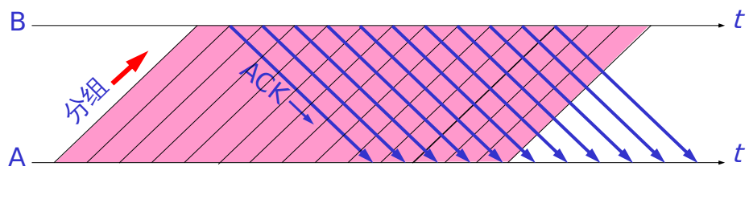

<link rel="stylesheet" href="../lib/font-awesome-4.7.0/css/font-awesome.min.css">
<link rel="stylesheet" href=../lib/my.css>

<a href="#top"><i class="fa fa-angle-up fa-3x button"></i></a>

### <a id='top' href="../README.md">计算机网络面试必考<i class="fa fa-reply" aria-hidden="true"></i></a>

星期一, 07. 八月 2017 09:52上午 
### 1.OSI分层 （7层）
物理层、数据链路层、网络层、传输层、会话层、表示层、应用层。

每一层的协议如下：

物理层：RJ45、CLOCK、IEEE802.3    （中继器，集线器，网关）

数据链路：PPP、FR、HDLC、VLAN、MAC  （网桥，交换机）

网络层：IP、ICMP、ARP、RARP、OSPF、IPX、RIP、IGRP、 （路由器）

传输层：TCP、UDP、SPX

会话层：NFS、SQL、NETBIOS、RPC

表示层：JPEG、MPEG、ASII

应用层：FTP、DNS、Telnet、SMTP、HTTP、WWW、NFS

每一层的作用如下：

物理层：通过媒介传输比特,确定机械及电气规范（比特Bit）

数据链路层：将比特组装成帧和点到点的传递（帧Frame）

网络层：负责数据包从源到宿的传递和网际互连（包PackeT）

传输层：提供端到端的可靠报文传递和错误恢复（段Segment）

会话层：建立、管理和终止会话（会话协议数据单元SPDU）

表示层：对数据进行翻译、加密和压缩（表示协议数据单元PPDU）

应用层：允许访问OSI环境的手段（应用协议数据单元APDU）

[OSI七层模型详解](http://blog.csdn.net/yaopeng_2005/article/details/7064869) 

---
### 2.TCP/IP分层（4层）
网络接口层、 网际层、运输层、 应用层。

---
### 3.五层协议（5层）
物理层、数据链路层、网络层、运输层、 应用层。

---
### 4.IP地址的分类

A类地址：以0开头， 第一个字节范围：0~127（1.0.0.0 - 126.255.255.255）；

B类地址：以10开头，    第一个字节范围：128~191（128.0.0.0 - 191.255.255.255）；

C类地址：以110开头，  第一个字节范围：192~223（192.0.0.0 - 223.255.255.255）；

10.0.0.0—10.255.255.255， 172.16.0.0—172.31.255.255， 192.168.0.0—192.168.255.255。（Internet上保留地址用于内部）

IP地址与子网掩码相与得到主机号

---
### 5.ARP是地址解析协议，简单语言解释一下工作原理。
1）每个主机都会在自己的ARP缓冲区中建立一个ARP列表，以表示IP地址和MAC地址之间的对应关系。

2）当源主机要发送数据时，首先检查ARP列表中是否有对应IP地址的目的主机的MAC地址，如果有，则直接发送数据，如果没有，就向本网段的所有主机发送ARP数据包，该数据包包括的内容有：源主机 IP地址，源主机MAC地址，目的主机的IP 地址。

3）当本网络的所有主机收到该ARP数据包时，首先检查数据包中的IP地址是否是自己的IP地址，如果不是，则忽略该数据包，如果是，则首先从数据包中取出源主机的IP和MAC地址写入到ARP列表中，如果已经存在，则覆盖，然后将自己的MAC地址写入ARP响应包中，告诉源主机自己是它想要找的MAC地址。

4）源主机收到ARP响应包后。将目的主机的IP和MAC地址写入ARP列表，并利用此信息发送数据。如果源主机一直没有收到ARP响应数据包，表示ARP查询失败。

>广播发送ARP请求，单播发送ARP响应。

---
### 6.各种协议
ICMP协议： 因特网控制报文协议。它是TCP/IP协议族的一个子协议，用于在IP主机、路由器之间传递控制消息。

TFTP协议： 是TCP/IP协议族中的一个用来在客户机与服务器之间进行简单文件传输的协议，提供不复杂、开销不大的文件传输服务。

HTTP协议： 超文本传输协议，是一个属于应用层的面向对象的协议，由于其简捷、快速的方式，适用于分布式超媒体信息系统。

DHCP协议： 动态主机配置协议，是一种让系统得以连接到网络上，并获取所需要的配置参数手段。

NAT协议：网络地址转换属接入广域网(WAN)技术，是一种将私有（保留）地址转化为合法IP地址的转换技术，

DHCP协议：一个局域网的网络协议，使用UDP协议工作，用途：给内部网络或网络服务供应商自动分配IP地址，给用户或者内部网络管理员作为对所有计算机作中央管理的手段。

---
### 7.描述：RARP
RARP是逆地址解析协议，作用是完成硬件地址到IP地址的映射，主要用于无盘工作站，因为给无盘工作站配置的IP地址不能保存。工作流程：在网络中配置一台RARP服务器，里面保存着IP地址和MAC地址的映射关系，当无盘工作站启动后，就封装一个RARP数据包，里面有其MAC地址，然后广播到网络上去，当服务器收到请求包后，就查找对应的MAC地址的IP地址装入响应报文中发回给请求者。因为需要广播请求报文，因此RARP只能用于具有广播能力的网络。

---
### 8.TCP三次握手和四次挥手的全过程，为什么会采用三次握手，若采用二次握手可以吗？
三次握手：
第一次握手：客户端发送syn包(syn=x)到服务器，并进入SYN_SEND状态，等待服务器确认；

第二次握手：服务器收到syn包，必须确认客户的SYN（ack=x+1），同时自己也发送一个SYN包（syn=y），即SYN+ACK包，此时服务器进入SYN_RECV状态；

第三次握手：客户端收到服务器的SYN＋ACK包，向服务器发送确认包ACK(ack=y+1)，此包发送完毕，客户端和服务器进入ESTABLISHED状态，完成三次握手。

握手过程中传送的包里不包含数据，三次握手完毕后，客户端与服务器才正式开始传送数据。理想状态下，TCP连接一旦建立，在通信双方中的任何一方主动关闭连接之前，TCP 连接都将被一直保持下去。

四次握手

与建立连接的“三次握手”类似，断开一个TCP连接则需要“四次握手”。

第一次挥手：主动关闭方发送一个FIN，用来关闭主动方到被动关闭方的数据传送，也就是主动关闭方告诉被动关闭方：我已经不 会再给你发数据了(当然，在fin包之前发送出去的数据，如果没有收到对应的ack确认报文，主动关闭方依然会重发这些数据)，但是，此时主动关闭方还可 以接受数据。

第二次挥手：被动关闭方收到FIN包后，发送一个ACK给对方，确认序号为收到序号+1（与SYN相同，一个FIN占用一个序号）。

第三次挥手：被动关闭方发送一个FIN，用来关闭被动关闭方到主动关闭方的数据传送，也就是告诉主动关闭方，我的数据也发送完了，不会再给你发数据了。

第四次挥手：主动关闭方收到FIN后，发送一个ACK给被动关闭方，确认序号为收到序号+1，至此，完成四次挥手。

采用三次握手是为了防止失效的连接请求报文段突然又传送到主机B，因而产生错误。失效的连接请求报文段是指：主机A发出的连接请求没有收到主机B的确认，于是经过一段时间后，主机A又重新向主机B发送连接请求，且建立成功，顺序完成数据传输。考虑这样一种特殊情况，主机A第一次发送的连接请求并没有丢失，而是因为网络节点导致延迟达到主机B，主机B以为是主机A又发起的新连接，于是主机B同意连接，并向主机A发回确认，但是此时主机A根本不会理会，主机B就一直在等待主机A发送数据，导致主机B的资源浪费。

---
### 9.在浏览器中输入www.baidu.com后执行的全部过程
1、客户端浏览器通过DNS解析到www.baidu.com的IP地址220.181.27.48，通过这个IP地址找到客户端到服务器的路径。客户端浏览器发起一个HTTP会话到220.161.27.48，然后通过TCP进行封装数据包，输入到网络层。

2、在客户端的传输层，把HTTP会话请求分成报文段，添加源和目的端口，如服务器使用80端口监听客户端的请求，客户端由系统随机选择一个端口如5000，与服务器进行交换，服务器把相应的请求返回给客户端的5000端口。然后使用IP层的IP地址查找目的端。

3、客户端的网络层不用关系应用层或者传输层的东西，主要做的是通过查找路由表确定如何到达服务器，期间可能经过多个路由器，这些都是由路由器来完成的工作，我不作过多的描述，无非就是通过查找路由表决定通过那个路径到达服务器。

4、客户端的链路层，包通过链路层发送到路由器，通过邻居协议查找给定IP地址的MAC地址，然后发送ARP请求查找目的地址，如果得到回应后就可以使用ARP的请求应答交换的IP数据包现在就可以传输了，然后发送IP数据包到达服务器的地址。

---
### 10.TCP和UDP的区别？
TCP提供面向连接的、可靠的数据流传输，而UDP提供的是非面向连接的、不可靠的数据流传输。

TCP传输单位称为TCP报文段，UDP传输单位称为用户数据报。

TCP注重数据安全性，UDP数据传输快，因为不需要连接等待，少了许多操作，但是其安全性却一般。

---
### 11.TCP对应的协议和UDP对应的协议
TCP对应的协议：

（1） FTP：定义了文件传输协议，使用21端口。

（2） Telnet：一种用于远程登陆的端口，使用23端口，用户可以以自己的身份远程连接到计算机上，可提供基于DOS模式下的通信服务。

（3） SMTP：邮件传送协议，用于发送邮件。服务器开放的是25号端口。

（4） POP3：它是和SMTP对应，POP3用于接收邮件。POP3协议所用的是110端口。

（5）HTTP：是从Web服务器传输超文本到本地浏览器的传送协议。

UDP对应的协议：

（1） DNS：用于域名解析服务，将域名地址转换为IP地址。DNS用的是53号端口。

（2） SNMP：简单网络管理协议，使用161号端口，是用来管理网络设备的。由于网络设备很多，无连接的服务就体现出其优势。

（3） TFTP(Trival File Tran敏感词er Protocal)，简单文件传输协议，该协议在熟知端口69上使用UDP服务。

---
### 12.DNS域名系统，简单描述其工作原理。
当DNS客户机需要在程序中使用名称时，它会查询DNS服务器来解析该名称。客户机发送的每条查询信息包括三条信息，包括：指定的DNS域名，指定的查询类型，DNS域名的指定类别。基于UDP服务，端口53. 该应用一般不直接为用户使用，而是为其他应用服务，如HTTP，SMTP等在其中需要完成主机名到IP地址的转换。

---
### 13.面向连接和非面向连接的服务的特点是什么？
面向连接的服务：通信双方在进行通信之前，要先在双方建立起一个完整的可以彼此沟通的通道，在通信过程中，整个连接的情况一直可以被实时地监控和管理。

非面向连接的服务：不需要预先建立一个联络两个通信节点的连接，需要通信的时候，发送节点就可以往网络上发送信息，让信息自主地在网络上去传，一般在传输的过程中不再加以监控。

---
### 14.了解交换机、路由器、网关的概念，并知道各自的用途
1）交换机

在计算机网络系统中，交换机是针对共享工作模式的弱点而推出的。交换机拥有一条高带宽的背部总线和内部交换矩阵。交换机的所有的端口都挂接在这条背 部总线上，当控制电路收到数据包以后，处理端口会查找内存中的地址对照表以确定目的MAC（网卡的硬件地址）的NIC（网卡）挂接在哪个端口上，通过内部 交换矩阵迅速将数据包传送到目的端口。目的MAC若不存在，交换机才广播到所有的端口，接收端口回应后交换机会“学习”新的地址，并把它添加入内部地址表中。

交换机工作于OSI参考模型的第二层，即数据链路层。交换机内部的CPU会在每个端口成功连接时，通过ARP协议学习它的MAC地址，保存成一张 ARP表。在今后的通讯中，发往该MAC地址的数据包将仅送往其对应的端口，而不是所有的端口。因此，交换机可用于划分数据链路层广播，即冲突域；但它不能划分网络层广播，即广播域。

交换机被广泛应用于二层网络交换，俗称“二层交换机”。

交换机的种类有：二层交换机、三层交换机、四层交换机、七层交换机分别工作在OSI七层模型中的第二层、第三层、第四层盒第七层，并因此而得名。

2）路由器

路由器（Router）是一种计算机网络设备，提供了路由与转送两种重要机制，可以决定数据包从来源端到目的端所经过的路由路径（host到host之间的传输路径），这个过程称为路由；将路由器输入端的数据包移送至适当的路由器输出端(在路由器内部进行)，这称为转送。路由工作在OSI模型的第三层——即网络层，例如网际协议。

路由器的一个作用是连通不同的网络，另一个作用是选择信息传送的线路。 路由器与交换器的差别，路由器是属于OSI第三层的产品，交换器是OSI第二层的产品(这里特指二层交换机)。

3）网关

网关（Gateway），网关顾名思义就是连接两个网络的设备，区别于路由器（由于历史的原因，许多有关TCP/IP的文献曾经把网络层使用的路由器（Router）称为网关，在今天很多局域网采用都是路由来接入网络，因此现在通常指的网关就是路由器的IP），经常在家庭中或者小型企业网络中使用，用于连接局域网和Internet。 网关也经常指把一种协议转成另一种协议的设备，比如语音网关。

在传统TCP/IP术语中，网络设备只分成两种，一种为网关（gateway），另一种为主机（host）。网关能在网络间转递数据包，但主机不能转送数据包。在主机（又称终端系统，end system）中，数据包需经过TCP/IP四层协议处理，但是在网关（又称中介系统，intermediate system）只需要到达网际层（Internet layer），决定路径之后就可以转送。在当时，网关 （gateway）与路由器（router）还没有区别。
在现代网络术语中，网关（gateway）与路由器（router）的定义不同。网关（gateway）能在不同协议间移动数据，而路由器（router）是在不同网络间移动数据，相当于传统所说的IP网关（IP gateway）。

网关是连接两个网络的设备，对于语音网关来说，他可以连接PSTN网络和以太网，这就相当于VOIP，把不同电话中的模拟信号通过网关而转换成数字信号，而且加入协议再去传输。在到了接收端的时候再通过网关还原成模拟的电话信号，最后才能在电话机上听到。

对于以太网中的网关只能转发三层以上数据包，这一点和路由是一样的。而不同的是网关中并没有路由表，他只能按照预先设定的不同网段来进行转发。网关最重要的一点就是端口映射，子网内用户在外网看来只是外网的IP地址对应着不同的端口，这样看来就会保护子网内的用户。

---
### 15.DHCP
动态主机配置协议 DHCP 提供了即插即用连网(plug-and-play networking)的机制。

这种机制允许一台计算机加入新的网络和获取IP地址而不用手工参与。

DHCP 使用客户服务器方式工作:

1.需要 IP 地址的主机在启动时就向 DHCP 服务器广播发送发现报文（DHCPDISCOVER），这时该主机就成为 DHCP 客户。

2.本地网络上所有主机都能收到此广播报文，但只有 DHCP 服务器才回答此广播报文。

3.DHCP 服务器先在其数据库中查找该计算机的配置信息。若找到，则返回找到的信息。若找不到，则从服务器的 IP 地址池(address pool)中取一个地址分配给该计算机。DHCP 服务器的回答报文叫做提供报文（DHCPOFFER）

---
### 16.套接字的作用

1.当应用进程需要使用网络进行通信时就发出系统调用，请求操作系统为其创建“套接字”，以便把网络通信所需要的系统资源分配给该应用进程。

2.操作系统为这些资源的总和用一个叫做套接字描述符的号码来表示，并把此号码返回给应用进程。应用进程所进行的网络操作都必须使用这个号码。

3.通信完毕后，应用进程通过一个关闭套接字的系统调用通知操作系统回收与该“号码”相关的所有资源.

---
### 17.运输层的主要功能
1.运输层为应用进程之间提供端到端的逻辑通信（但网络层是为主机之间提供逻辑通信）。

2.运输层还要对收到的报文进行差错检测。

3.运输层需要有两种不同的运输协议，即面向连接的 TCP 和无连接的 UDP。

---
### 18.自动重传请求ARQ (Automatic Repeat reQuest)

使用确认和重传机制，可以在不可靠的传输网络上实现可靠的通信。这种可靠传输协议常称为自动重传请求ARQ.

ARQ 表明重传的请求是自动进行的。接收方不需要请求发送方重传某个出错的分组 。

---
### 19.流水线传输
发送方可连续发送多个分组，不必每发完一个分组就停顿下来等待对方的确认。

由于信道上一直有数据不间断地传送，这种传输方式可获得很高的信道利用率。

---
### 20.TCP 可靠通信的具体实现
1.TCP 连接的每一端都必须设有两个窗口——一个发送窗口和一个接收窗口。

2.TCP 的可靠传输机制用字节的序号(TCP报文段的首部中有序号段)进行控制。TCP 所有的确认都是基于序号而不是基于报文段。

3.TCP 两端的四个窗口经常处于动态变化之中。

4.TCP连接的往返时间 RTT 也不是固定不变的。需要使用特定的算法估算较为合理的重传时间。

---
### 21.TCP四种计时器

TCP共使用以下四种计时器，即重传计时器、坚持计时器、保活计时器和时间等待计时器 。这几个计时器的主要特点如下：

1、重传计时器
当TCP发送报文段时，就创建该特定报文段的重传计时器 。可能发生两种情况： 

（1）、若在计时器截止时间到（ 通常是60秒 ）之前收到了对此特定报文段的确认，则撤销此计时器。 

（2）、若在收到了对此特定报文段的确认之前计时器截止期到，则重传此报文段，并将计时器复位。 

2、坚持计时器 

为了对付零窗口大小通知，TCP需要另一个计时器。假定接收TCP宣布了窗口大小为零。发送TCP就停止传送报文段，直到接收TCP发送确认并宣布一个非零的窗口大小。但这个确认可能会丢失。我们知道在TCP中，对确认是不需要发送确认的。若确认丢失了，接收TCP并不知道，而是会认为它已经完成任务了，并等待着发送TCP接着会发送更多的报文段。但发送TCP由于没有收到确认，就等待对方发送确认来通知窗口的大小。双方的TCP都在永远地等待着对方。 

要打开这种死锁，TCP为每一个连接使用一个坚持计时器。 当发送TCP收到一个窗口大小为零的确认时，就启动坚持计时器 。 当坚持计时器期限到时，发送TCP就发送一个特殊的报文段， 叫做探测报文段 。这个报文段只有一个字节的数据。它有一个序号，但它的序号永远不需要确认；甚至在计算对其他部分的数据的确认时该序号也被忽略。探测报文段提醒对端：确认已丢失，必须重传。 

坚持计时器的值设置为重传时间的数值。但是，若没有收到从接收端来的响应，则需发送另一个探测报文段，并将坚持计时器的值加倍和复位。发送端继续发送探测报文段，将坚持计时器设定的值加倍和复位，直到这个值增大到门限值（ 通常是60秒 ）为止。在这以后，发送端每隔60秒就发送一个探测报文段，直到窗口重新打开。 

3、保活计时器 

保活计时器使用在某些实现中，用来防止在两个TCP之间的连接出现长时期的空闲。假定客户打开了到服务器的连接，传送了一些数据，然后就保持静默了。也许这个客户出故障了。在这种情况下，这个连接将永远地处理打开状态。 

要解决这种问题，在大多数的实现中都是使服务器设置保活计时器。每当服务器收到客户的信息，就将计时器复位。保活计时器 通常设置为2小时 。若服务器过了2小时还没有收到客户的信息，它就发送探测报文段。若发送了10个探测报文段（每一个相隔75秒）还没有响应，就假定客户出了故障，因而就终止该连接。 

4、时间等待计时器 

时间等待计时器是在连接终止期间使用的 。当TCP关闭一个连接时，它并不认为这个连接马上就真正地关闭了。在时间等待期间中，连接还处于一种中间过渡状态。这就可以使重复的FIN报文段（如果有的话）可以到达目的站因而可将其丢弃。这个计时器的值通常设置为一个报文段的寿命期待值的两倍 。

5.[在这里看一下http相关的内容](https://github.com/LEAGUE-OF-BME/InterviewFAQ/blob/master/FrontEnd/web.md)
